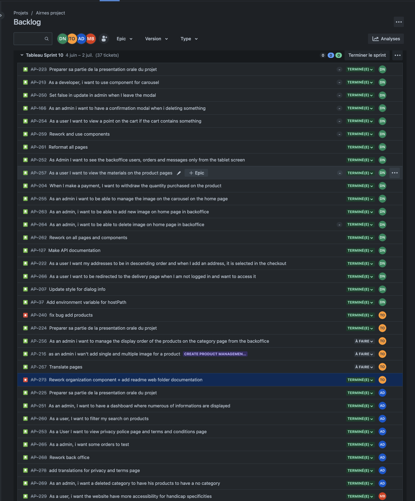

RAPPORT DE SPRINT 10

### _Activités générales :_

**DN :** Djibril NAJI / **TO :** Thomas Oliviera / **AD :** Alexis DUCHEMANN / **MB :** Myriam BENABDESSADOK

# Changelog

## **Djibril**

- [djibrilnaji] 4c4a6c734 2023-07-02 | add info (feature/AP-37-add-environment-variable-for-host-path)
- [djibrilnaji] 1c5bc9b7f 2023-07-02 | use path in payment page and call it on checkoutForm
- [djibrilnaji] ed8de1e0e 2023-07-02 | add hostPath in .env
- [DjibrilNaji] f0b8c69ee 2023-07-02 | Merge branch 'release/sprint10' into feature/AP-268-rework-back-office
- [DjibrilNaji] 8b239ac4e 2023-07-02 | Merge pull request #169 from DjibrilNaji/AP-273-rework-components-folder-add-web-documentation
- [DjibrilNaji] d7e9a910c 2023-07-02 | Update README.md
- [djibrilnaji] b2a2522cb 2023-07-01 | remove trad + add modal in admin and update in existant modal (feature/AP-207-update-style-for-dialog-info)
- [djibrilnaji] beafb722b 2023-07-01 | update style of dialog
- [djibrilnaji] ea6bc7ba9 2023-07-01 | add select boolean on component (bug/select-not-visible) -[djibrilnaji] da171422a 2023-07-01 | add query on delivery + add ternary if the redirection query exist (feature/AP-266-as-a-user-i-want-to-be-redirected-to-the-delivery-page-when-i-am-not-logged-in-and-want-to-access-it)
- [djibrilnaji] e09c9e496 2023-07-01 | add order on checkout (feature/AP-222-as-a-user-i-want-my-addresses-to-be-in-descending-order-and-when-i-add-an-address-it-is-selected-in-the-checkout)
- [djibrilnaji] 95aa5e58f 2023-07-01 | add order on endpoint if order exist
- [djibrilnaji] 1f101e334 2023-07-01 | add routes with query params + use it on service.
- [djibrilnaji] 79763f7f9 2023-07-01 | Merge branch 'release/sprint10' into feature/AP-264-as-an-admin-i-want-to-be-able-to-delete-image-on-home-page-in-backoffice (feature/AP-264-as-an-admin-i-want-to-be-able-to-delete-image-on-home-page-in-backoffice)
- [djibrilnaji] 33f9bb5b7 2023-07-01 | update error message (feature/AP-263-as-an-admin-i-want-to-be-able-to-add-new-image-on-home-page-in-backoffice)
- [djibrilnaji] 7d79d572c 2023-07-01 | Merge remote-tracking branch 'origin/release/sprint10' into feature/AP-263-as-an-admin-i-want-to-be-able-to-add-new-image-on-home-page-in-backoffice
- [djibrilnaji] f552402ec 2023-07-01 | Merge remote-tracking branch 'origin/release/sprint10' into feature/AP-264-as-an-admin-i-want-to-be-able-to-delete-image-on-home-page-in-backoffice
- [djibrilnaji] af8badeb2 2023-07-01 | use them on backoffice image home page
- [djibrilnaji] 45746203b 2023-07-01 | add route + endpoint + service for delete image
- [djibrilnaji] 19bbc2047 2023-07-01 | add function to add image on the bdd and on the S3
- [djibrilnaji] 706e90cdb 2023-07-01 | Add image home page endpoint, route and service
- [djibrilnaji] 815798ff8 2023-07-01 | Merge branch 'feature/AP-262-rework-on-all-pages-and-components' into feature/AP-263-as-an-admin-i-want-to-be-able-to-add-new-image-on-home-page-in-backoffice
- [djibrilnaji] c5f015d66 2023-07-01 | update style (feature/AP-262-rework-on-all-pages-and-components)
- [djibrilnaji] 94b212114 2023-07-01 | revert file because it's not my page
- [djibrilnaji] b7442509b 2023-07-01 | add condition
- [djibrilnaji] 40b13fad4 2023-07-01 | use app context
- [djibrilnaji] a73f8b0eb 2023-06-30 | Revert "test vercel" (feature/AP-127-make-api-documentation)
- [djibrilnaji] 120c9c6a7 2023-06-30 | test vercel
- [djibrilnaji] 3f9bd4f3e 2023-06-30 | Make api documentation
- [djibrilnaji] afdf646be 2023-06-30 | move file
- [djibrilnaji] e74894036 2023-06-30 | Add readme to explain project
- [djibrilnaji] 631c41de5 2023-06-30 | use app context and remove useless function and variables
- [djibrilnaji] 69359fa5d 2023-06-30 | update seed
- [djibrilnaji] 132b9e260 2023-06-30 | Use app context on the component for Admin
- [djibrilnaji] 12843aec2 2023-06-30 | add all functions for admin in appContext
- [djibrilnaji] 5685a9170 2023-06-30 | use useEffects because there was error
- [djibrilnaji] a18c0c06d 2023-06-30 | Little update + add sortColumn on order endpoint for backoffice
- [djibrilnaji] 0bbdd4bc6 2023-06-30 | Add traductions for my pages
- [djibrilnaji] 286005de1 2023-06-30 | Update routes + use routes in all pages
- [DjibrilNaji] c546cbdba 2023-06-26 | Merge pull request #150 from DjibrilNaji/fix-order-number-article
- [DjibrilNaji] 546068fb8 2023-06-26 | Merge pull request #151 from DjibrilNaji/fix-pagination-product
- [djibrilnaji] eb38f675d 2023-06-26 | Update style + improve product page (feature/AP-262-rework-on-carousel-component-and-product-page)
- [djibrilnaji] d1c527b62 2023-06-26 | Update carousel component
- [djibrilnaji] 9e4faff2d 2023-06-26 | Add home page admin in backoffice and use new endpoint in this (feature/AP-255-as-an-admin-i-want-to-be-able-to-manage-the-image-on-the-carousel-on-the-home-page)
- [djibrilnaji] 1c205a571 2023-06-26 | call services + add routes on navBar
- [djibrilnaji] d8040b6b4 2023-06-26 | Services and endpoint to chnage display of images
- [djibrilnaji] a0eeeb809 2023-06-26 | Service and endpoint to get all images
- [djibrilnaji] b3acd898f 2023-06-26 | Add routes
- [djibrilnaji] c00fbb7c1 2023-06-26 | Remove useless code
- [djibrilnaji] d347d81ab 2023-06-26 | Merge branch 'release/sprint10' into feature/AP-255-as-an-admin-i-want-to-be-able-to-manage-the-image-on-the-carousel-on-the-home-page
- [djibrilnaji] ffc1b5a07 2023-06-26 | Merge branch 'release/sprint10' into feature/AP-255-as-an-admin-i-want-to-be-able-to-manage-the-image-on-the-carousel-on-the-home-page
- [djibrilnaji] 08251ab8d 2023-06-26 | use stockValidator and use stock === 0 if stock doesn't exist (feature/AP-204-when-i-make-a-payment-i-want-to-withdraw-the-quantity-purchased-on-the-product)
- [djibrilnaji] a788fdca0 2023-06-26 | add stock validator
- [djibrilnaji] 8411f84e0 2023-06-26 | use relation instead of the other method (feature/AP-257-as-a-user-i-want-to-view-the-materials-on-the-product-pages)
- [djibrilnaji] 2e965ff3d 2023-06-26 | Merge branch 'release/sprint10' into feature/AP-255-as-an-admin-i-want-to-be-able-to-manage-the-image-on-the-carousel-on-the-home-page
- [djibrilnaji] 5f6844255 2023-06-26 | use the services and add modal with materials
- [djibrilnaji] 382f29ec9 2023-06-26 | add route and new service
- [djibrilnaji] c2e301b2b 2023-06-26 | add endpoint
- [djibrilnaji] 846d14cd7 2023-06-26 | add model
- [djibrilnaji] 2ac0640db 2023-06-26 | The backoffice is only display after md breakpoint (feature/AP-252-as-admin-i-want-to-see-the-backoffice-users-orders-and-messages-only-from-the-tablet-screen)
- [djibrilnaji] 0df4e69d7 2023-06-26 | use updateProduct in the Checkout form
- [djibrilnaji] fce3bd1bd 2023-06-26 | add stock on the variable
- [djibrilnaji] 1d9083189 2023-06-26 | Add condition on the endpoint
- [djibrilnaji] b4c29618b 2023-06-25 | add hook because when I was remove them an error has occured (feature/AP-261-reformat-all-pages)
- [djibrilnaji] dd0cfbaed 2023-06-25 | good page indentation + remove useless hook
- [djibrilnaji] ddb48d91b 2023-06-25 | Merge branch 'release/sprint10' into feature/AP-255-as-an-admin-i-want-to-be-able-to-manage-the-image-on-the-carousel-on-the-home-page
- [djibrilnaji] e8368c132 2023-06-25 | Use modal component for order (feature/AP-259-rework-and-use-components)
- [djibrilnaji] b4d29cd9d 2023-06-25 | Use All new components on the admin pages
- [djibrilnaji] 30b808110 2023-06-25 | add new button component and replace them
- [djibrilnaji] 2c41b339c 2023-06-25 | Rename import
- [djibrilnaji] c99de15b6 2023-06-25 | Rename import
- [djibrilnaji] b648401cc 2023-06-25 | Rename import
- [djibrilnaji] 525a3c541 2023-06-25 | Use Title, SelectAndSearch, Pagination and Table components on the one component
- [djibrilnaji] e53d7d972 2023-06-25 | Add title component + update tableHead component
- [djibrilnaji] 871d78e30 2023-06-25 | Add Table component which use tableHead and tableBody
- [djibrilnaji] e58163296 2023-06-25 | add new components for Head and Body in table
- [djibrilnaji] 190af8655 2023-06-25 | Create search component + use search and select in the same component
- [djibrilnaji] 741624167 2023-06-25 | add key on pagination to remove error on console
- [djibrilnaji] 58b4e5ff7 2023-06-25 | Remove hook + add query on service
- [djibrilnaji] c49bac1b5 2023-06-25 | Remove useless file
- [djibrilnaji] 75f8800c9 2023-06-25 | Add components for form and use it on register/login/contac/checkEmail/ResetPassword
- [djibrilnaji] f96416560 2023-06-25 | Add components for confirmation messages for checkout and contact + add new routes and use them
- [djibrilnaji] eeeb5b6cc 2023-06-18 | Add point if the cart contain something (feature/AP-254-as-a-user-i-want-to-view-a-point-on-the-cart-if-the-cart-contains-something)
- [djibrilnaji] be1907152 2023-06-18 | use components to delete users (feature/AP-166-as-an-admin-i-want-to-have-a-confirmation-modal-when-i-deleting-something)
- [djibrilnaji] 09a870ee6 2023-06-18 | Use component on contact page
- [djibrilnaji] fbc7d493a 2023-06-18 | Add new components
- [djibrilnaji] d3e7f25ce 2023-06-05 | add function to close modal and set toggle to true (feature/AP-250-set-false-in-update-in-admin-when-i-leave-the-modal)
- [djibrilnaji] 2c26153ea 2023-06-05 | Add components for carousel (feature/AP-213-as-a-developer-i-want-to-use-component-for-carousel)
- [djibrilnaji] c257489a6 2023-06-04 | Add sprint report 9 (origin/release/sprint9, release/sprint9)
- [DjibrilNaji] 6b2320146 2023-06-04 | Merge pull request #137 from DjibrilNaji/feature/AP-245-as-a-user-i-want-to-modify-a-category
- [djibrilnaji] aa8e31dbc 2023-06-04 | fix bug when add product in cart from favorite (bug/AP-249-fix-bug-add-product-in-cart-from-favorites)
- [djibrilnaji] 556d6a15d 2023-06-04 | Add new pagination (feature/AP-248-update-pagination-in-bo)
- [djibrilnaji] 8e923a9f4 2023-06-04 | Merge branch 'release/sprint9' into feature/AP-248-update-pagination-in-bo
- [djibrilnaji] ef40cb094 2023-06-04 | add navbar items components (feature/AP-235-make-some-components-if-is-necessary)
- [djibrilnaji] ea19c4957 2023-06-04 | add empty page components
- [djibrilnaji] ea0c8a49d 2023-06-04 | Add banner component and categories/products components
- [djibrilnaji] da00a2efc 2023-06-04 | Remove useless components
- [djibrilnaji] 952e13dc4 2023-06-04 | Add select show component in admin page
- [djibrilnaji] 45d9ccafb 2023-06-04 | Merge branch 'release/sprint9' into feature/AP-235-make-some-components-if-is-necessary
- [djibrilnaji] 8011eaba9 2023-06-04 | Add modal for order infos in BO (feature/AP-244-as-an-admin-i-want-to-view-order-info-in-a-modal-in-bo)
- [djibrilnaji] a34957740 2023-06-04 | Merge branch 'release/sprint9' into feature/AP-244-as-an-admin-i-want-to-view-order-info-in-a-modal-in-bo
- [djibrilnaji] 226fb8f49 2023-06-04 | Add confirmation page and remove all in cart after payment (feature/AP-165-as-a-user-i-want-to-have-a-confirmation-page-when-i-have-pay)
- [djibrilnaji] 188bfa6fd 2023-06-04 | Merge branch 'release/sprint9' into feature/AP-165-as-a-user-i-want-to-have-a-confirmation-page-when-i-have-pay
- [djibrilnaji] 6cea67694 2023-06-04 | add select for admin in bo for edit user form (feature/AP-247-as-an-admin-i-want-to-have-a-select-in-edit-user-form-for-the-admin-field)
- [djibrilnaji] 750b2cacc 2023-06-04 | add select for admin in bo for edit user form

## **Thomas**

- [Thomas-De-Oliveira] c5524c48b 2023-07-02 | Merge pull request #177 from DjibrilNaji/feature/AP-37-add-environment-variable-for-host-path (HEAD -> release/sprint10, origin/release/sprint10)
- [Thomas-De-Oliveira] 4c86e5785 2023-07-02 | Merge pull request #174 from DjibrilNaji/feature/AP-272-as-a-user-i-can-view-more-infos-of-the-company-in-about-page
- [Thomas-De-Oliveira] b33521be1 2023-07-02 | Merge pull request #176 from DjibrilNaji/feature/AP-278-add-translations-for-terms-privacy
- [Thomas-De-Oliveira] ed9ba8483 2023-07-02 | Merge pull request #173 from DjibrilNaji/task/add-read-me-for-translations
- [Thomas-De-Oliveira] 17be79bf9 2023-07-02 | Merge pull request #163 from DjibrilNaji/feature/AP-268-rework-back-office
- [Thomas-De-Oliveira] 892544ffc 2023-07-02 | Merge pull request #171 from DjibrilNaji/feature/AP-258-as-a-user-if-another-person-try-to-sign-in-with-my-login-infos-i-will-be-prevent
- [Thomas-De-Oliveira] 4e999f143 2023-07-02 | add @ for route in code (origin/documentation-component)
- [Thomas-De-Oliveira] c230b0ded 2023-07-02 | fix import (documentation-component)
- [Thomas-De-Oliveira] 8527fe967 2023-07-02 | reorganisation of the component folder and add readme web
- [Thomas-De-Oliveira] 1a9cffe21 2023-07-01 | Merge pull request #159 from DjibrilNaji/feature/AP-264-as-an-admin-i-want-to-be-able-to-delete-image-on-home-page-in-backoffice
- [Thomas-De-Oliveira] 297942601 2023-07-01 | Merge pull request #158 from DjibrilNaji/feature/AP-263-as-an-admin-i-want-to-be-able-to-add-new-image-on-home-page-in-backoffice
- [Thomas-De-Oliveira] 1009a1b4c 2023-07-01 | Merge pull request #157 from DjibrilNaji/feature/AP-127-make-api-documentation
- [Thomas-De-Oliveira] f178b977a 2023-07-01 | Merge pull request #156 from DjibrilNaji/feature/AP-262-rework-on-all-pages-and-components
- [Thomas-De-Oliveira] b930948c9 2023-06-27 | Merge pull request #155 from DjibrilNaji/feature/AP-260-as-a-user-i-want-to-filter-my-search-on-products-results
- [Thomas-De-Oliveira] b2097e9d2 2023-06-27 | Merge pull request #154 from DjibrilNaji/feature/AP-265-as-a-admin-i-want-some-orders-to-test
- [Thomas-De-Oliveira] 9173e8f9f 2023-06-27 | Merge pull request #153 from DjibrilNaji/feature/AP-251-as-an-admin-i-want-to-see-charts
- [Thomas-De-Oliveira] 91c40129c 2023-06-26 | add in order and contact BO
- [Thomas-De-Oliveira] 9c62abfb2 2023-06-26 | Merge pull request #152 from DjibrilNaji/feature/AP-262-rework-on-carousel-component-and-product-page
- [Thomas-De-Oliveira] d69cb8b27 2023-06-26 | add componant (fix-pagination-product)
- [Thomas-De-Oliveira] 12fb8e8a2 2023-06-26 | Merge pull request #149 from DjibrilNaji/feature/AP-255-as-an-admin-i-want-to-be-able-to-manage-the-image-on-the-carousel-on-the-home-page
- [Thomas-De-Oliveira] d2b72baa4 2023-06-26 | fix pagination product
- [Thomas-De-Oliveira] fd887ddc5 2023-06-26 | fix number product
- [Thomas-De-Oliveira] 48a0a3326 2023-06-26 | Merge pull request #146 from DjibrilNaji/feature/AP-204-when-i-make-a-payment-i-want-to-withdraw-the-quantity-purchased-on-the-product
- [Thomas-De-Oliveira] 53853b5ab 2023-06-26 | Merge pull request #148 from DjibrilNaji/feature/AP-257-as-a-user-i-want-to-view-the-materials-on-the-product-pages
- [Thomas-De-Oliveira] 782e7ca4b 2023-06-26 | Merge pull request #147 from DjibrilNaji/feature/AP-252-as-admin-i-want-to-see-the-backoffice-users-orders-and-messages-only-from-the-tablet-screen
- [Thomas-De-Oliveira] 0b94f1ca3 2023-06-25 | Merge pull request #142 from DjibrilNaji/feature/AP-254-as-a-user-i-want-to-view-a-point-on-the-cart-if-the-cart-contains-something
- [Thomas-De-Oliveira] ae728c1f4 2023-06-25 | Merge pull request #141 from DjibrilNaji/feature/AP-166-as-an-admin-i-want-to-have-a-confirmation-modal-when-i-deleting-something
- [Thomas-De-Oliveira] 11e25ad1e 2023-06-25 | Merge branch 'release/sprint10' into feature/AP-166-as-an-admin-i-want-to-have-a-confirmation-modal-when-i-deleting-something
- [Thomas-De-Oliveira] cc1b08808 2023-06-25 | Merge pull request #140 from DjibrilNaji/feature/AP-250-set-false-in-update-in-admin-when-i-leave-the-modal
- [Thomas-De-Oliveira] ad7cac16e 2023-06-25 | Merge pull request #139 from DjibrilNaji/feature/AP-213-as-a-developer-i-want-to-use-component-for-carousel
- [Thomas-De-Oliveira] ac30b3649 2023-06-04 | add layout admin in create product page
- [Thomas-De-Oliveira] a9afaa97b 2023-06-04 | delete price formatted in create api products
- [Thomas-De-Oliveira] a4fe3a730 2023-06-04 | Merge pull request #134 from DjibrilNaji/feature/AP-248-update-pagination-in-bo
- [Thomas-De-Oliveira] 456e15075 2023-06-04 | Merge pull request #131 from DjibrilNaji/feature/AP-165-as-a-user-i-want-to-have-a-confirmation-page-when-i-have-pay
- [Thomas-De-Oliveira] 8b3307a38 2023-06-04 | Merge pull request #130 from DjibrilNaji/feature/AP-247-as-an-admin-i-want-to-have-a-select-in-edit-user-form-for-the-admin-field
- [Thomas-De-Oliveira] 6f2bffdd5 2023-06-04 | Merge pull request #128 from DjibrilNaji/feature/AP-136-as-a-user-i-want-to-pay-with-stripe

## **Alexis**

- [Alexis Duchemann] 7b7e94e12 2023-07-02 | add translations
- [Alexis Duchemann] 64bccce7a 2023-07-02 | add readme docs for translations
- [Alexis Duchemann] 4f7d6566b 2023-07-02 | add terms and privacy
- [Alexis Duchemann] b38537248 2023-07-02 | add can't delete no category
- [Alexis Duchemann] e13da0c2e 2023-07-02 | fix import
- [Alexis Duchemann] e157ed0e5 2023-07-02 | small fix (feature/AP-268-rework-back-office)
- [Alexis Duchemann] 1d10702e9 2023-07-02 | update seed
- [Alexis Duchemann] 7582fff28 2023-07-01 | del cat to have his products to have no cat
- [Alexis Duchemann] aad087046 2023-07-01 | fix
- [Alexis Duchemann] 3974ed677 2023-07-01 | rework categories page
- [Alexis Duchemann] 0420fae7d 2023-07-01 | Merge remote-tracking branch 'origin/release/sprint10' into feature/AP-268-rework-back-office
- [Alexis Duchemann] 3864f364a 2023-07-01 | Merge pull request #164 from DjibrilNaji/feature/AP-207-update-style-for-dialog-info
- [Alexis Duchemann] 3445015de 2023-07-01 | fix admin
- [Alexis Duchemann] bd2e28c4a 2023-07-01 | rework categories
- [Alexis Duchemann] c9ec9e02a 2023-07-01 | delete useless page
- [Alexis Duchemann] facada6f0 2023-07-01 | Merge pull request #162 from DjibrilNaji/bug/select-not-visible
- [Alexis Duchemann] 040803ae0 2023-07-01 | Merge pull request #161 from DjibrilNaji/feature/AP-266-as-a-user-i-want-to-be-redirected-to-the-delivery-page-when-i-am-not-logged-in-and-want-to-access-it
- [Alexis Duchemann] a9a7f028f 2023-07-01 | Merge pull request #160 from DjibrilNaji/feature/AP-222-as-a-user-i-want-my-addresses-to-be-in-descending-order-and-when-i-add-an-address-it-is-selected-in-the-checkout
- [Alexis Duchemann] 191788e0f 2023-06-27 | update search and add filters
- [Alexis Duchemann] dba13b9fd 2023-06-27 | add some orders
- [Alexis Duchemann] 485644ed4 2023-06-27 | created components for chart
- [Alexis Duchemann] 2f0c8b49f 2023-06-27 | created service and routes
- [Alexis Duchemann] 7c10aebdc 2023-06-27 | create api pages
- [Alexis Duchemann] c68e21348 2023-06-27 | add in ContextProvider in admin dashboard
- [Alexis Duchemann] ca8728e49 2023-06-27 | install dependecies
- [Alexis Duchemann] b407c522c 2023-06-25 | Merge pull request #145 from DjibrilNaji/feature/AP-261-reformat-all-pages
- [Alexis Duchemann] adf60da9c 2023-06-25 | Merge pull request #144 from DjibrilNaji/feature/AP-261-reformat-all-pages
- [Alexis Duchemann] 8201befae 2023-06-25 | Merge pull request #143 from DjibrilNaji/feature/AP-259-rework-and-use-components
- [Alexis Duchemann] f5f22c8e2 2023-06-04 | Merge pull request #136 from DjibrilNaji/bug/AP-249-fix-bug-add-product-in-cart-from-favorites
- [Alexis Duchemann] 93398bd59 2023-06-04 | Merge pull request #138 from DjibrilNaji/AP-240-fix-bug-create-product
- [Alexis Duchemann] ea7c83e8e 2023-06-04 | add modal to update and see one cat (feature/AP-245-as-a-user-i-want-to-modify-a-category)
- [Alexis Duchemann] 8b91cf295 2023-06-04 | service in context
- [Alexis Duchemann] d5dc6d70b 2023-06-04 | create services and api for get, patch single cat
- [Alexis Duchemann] a8538af55 2023-06-04 | Merge pull request #133 from DjibrilNaji/feature/AP-235-make-some-components-if-is-necessary
- [Alexis Duchemann] e5503dfe7 2023-06-04 | Merge pull request #132 from DjibrilNaji/feature/AP-244-as-an-admin-i-want-to-view-order-info-in-a-modal-in-bo

## **Myriam**

- [myrm02] 58c7eee97 2023-07-02 | Merge pull request #172 from DjibrilNaji/feature/AP-253-as-a-user-i-want-to-view-privacy-police-page-and-terms-and-conditions-page
- [Myriam BENABDESSADOK] b1cdbbca4 2023-07-02 | Add about us page
- [Myriam BENABDESSADOK] 303c71c46 2023-07-02 | Mail sending invalid credentials correction
- [Myriam BENABDESSADOK] b9332ef87 2023-07-02 | Add prevention mail for invalid credentials

# _Rétrospective de sprint :_

> ## **Djibril**
>
> ### Avis Positifs :
>
> - Très content du travail que j'ai fourni ainsi que de celui de mes camarades. Un travail qui a porté ses fruits.
> - J'en ressort avec beaucoup plus de connaissance qu'au début.
>
> ### Avis négatifs :
>
> - Aucun pour ce sprint
>
> ### Questions et point :
>
> - Aucune pour ce sprint

> ## **Thomas**
>
> ### Avis Positifs :
>
> - Fin du projet, j'en ressort avec une très bonne expérience et de meilleurs idées et inspiration pour mes futurs projet a venir.
>
> ### Avis négatifs :
>
> - Aucun pour ce sprint
>
> ### Questions et point:
>
> - Aucune pour ce sprint
>
> ## **Alexis**
>
> ### Avis Positifs :
>
> - Je suis content de ce que j’ai pu apprendre au fur et a mesure du projet.
>
> ### Avis négatif
>
> - Aucun
>
> ## **Myriam**

> - Cela m'as permis de m'expertiser un peu plus dans le fonctionnement d'une solution web
> - C'est la première qu'on réalise un site from scratch complet
>
> ### Avis négatif
>
> - J'ai pas vraiment de point négatif
