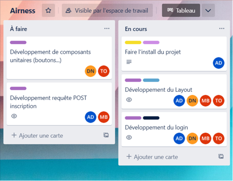

RAPPORT DE SPRINT 2

### *Activités générales :*

- Changement de tout le stack : Next.js (front-end) et MongoDB (base de données)

- Développement du Layout en React mais pas de push en raison du changement de stack

- Création du projet Next.js

- Commencement d’adaptation modélisation SQL en modèle MongoDB en créant la base de données

### *Rétrospective de sprint :*

Aucun commentaire et difficulté rencontrée pour les quatre membre
