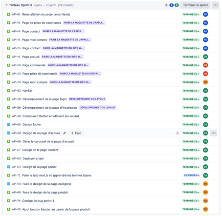

RAPPORT DE SPRINT 3

### *Activités générales :*

**DN :** Djibril NAJI / TO : Thomas Oliviera / AD : Alexis DUCHEMANN / MB: Myriam BENABDESSADOK

- Finition des maquettes

- Design de presque tous les pages de l’application ( Front )

### *Rétrospective de sprint :*

Quelques conflits lors des merges qui ont été rapidement réglés

# Tickets par personne :

### *Djibril NAJI :*

- AP – 62 : Navbar
- AP – 29 : Développement de la page login
- AP – 28 : Développement de la page d'inscription
- AP – 30 : Composant Button en utilisant les variant
- AP – 65 : Design footer
- AP – 64 : Design de la page d’accueil
- AP – 66 : Gérer le carousel de la page d’accueil
- AP – 67 : Design de la page contact
- AP – 69 : Déployer le projet sur vercel
- AP – 63: Design page panier
- AP - 72 : Faire le tuto nextJS pour apprendre les bases

### *Thomas Oliviera :*

- AP - 59 : Faire le design de la page catégorie
- AP - 60 : Faire le design de la page produit
- AP - 74 : Corriger le bug lié au merge du sprint 3
- AP - 75 : Ajouter le bouton "Ajouter au panier" de la page produit

### *Alexis Duchemann :*

- AP - 61 : Reinstallation du projet avec NextJS

*Maquette application*

- AP - 10 : Page de prise de commande
- AP - 14 : Page contact
- AP - 15 : Page mon compte

*Maquette site web*

- AP - 25 : Page contact
- AP - 16 : Page d'accueil
- AP - 20 : Page commande
- AP - 23 : Page prise de commande
- AP - 24 : Page mon compte 