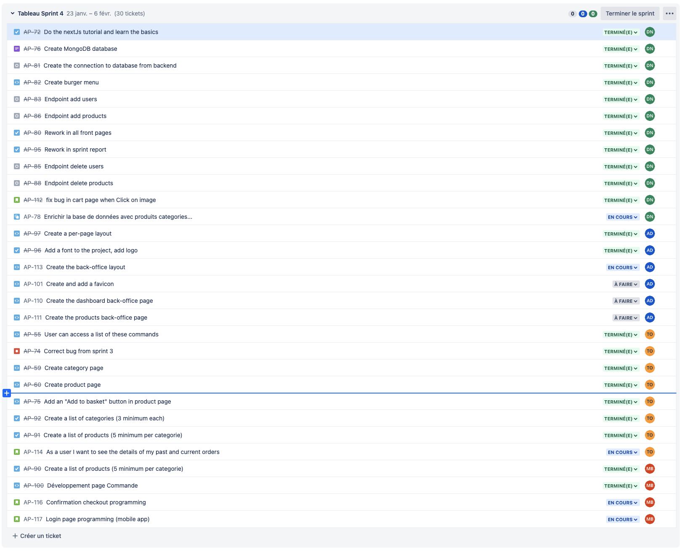

RAPPORT DE SPRINT 4

### *Activités générales :*

**DN :** Djibril NAJI / **TO :** Thomas Oliviera / **AD :** Alexis DUCHEMANN / **MB :** Myriam BENABDESSADOK

- Intégration de plusieurs maquettes
- Design de presque tous les pages de l’application ( Front )
- Première connection a la BDD + ajout de certaines routes (ainsi que l'affichage)

# Changelog

## Djibril

- [DjibrilNaji] 841b90c 2023-02-05 | Merge pull request #39 from DjibrilNaji/release/sprint4 (HEAD -> release/sprint5,
  origin/release/sprint5, origin/main)
- [DjibrilNaji] e1e04e8 2023-02-05 | Merge pull request #38 from DjibrilNaji/feature/AP-114-details-of-order (
  origin/release/sprint4)
- [DjibrilNaji] ddb5bc0 2023-02-05 | Merge pull request #37 from DjibrilNaji/AP-101-add-a-favicon
- [djibrilnaji] e24e8e8 2023-02-02 | Indent all files (release/sprint4)
- [djibrilnaji] fa902cd 2023-02-02 | AP 112 : bug fix change URL in link (origin/feature/AP-112-fix-bug-in-cart-page)
- [djibrilnaji] 60efdf9 2023-02-02 | AP 78 : update function with async functions in pages (
  feature/AP-78-display-new-products-from-BDD)
- [DjibrilNaji] 1ecc4c1 2023-02-02 | Merge pull request #32 from DjibrilNaji/feature/AP-97-create-a-per-page-layout
- [djibrilnaji] 9b9159c 2023-02-01 | AP 78 : Remove useless component
- [djibrilnaji] d95ff35 2023-02-01 | AP 78 : Delete useless images and add new images + Update image in accueil +
  display categories in categories page + update image in products page
- [djibrilnaji] 4893281 2023-02-01 | AP 78 : Update navbar and layout for displaying
- [djibrilnaji] df40f9c 2023-02-01 | AP 78 : rename produits to products
- [djibrilnaji] d4917fb 2023-02-01 | AP 78 : add new products and categories in BDD and display them
- [djibrilnaji] 28241e3 2023-02-01 | AP 78 : add new products and categories in BDD and display them
- [DjibrilNaji] 49f926c 2023-02-01 | Merge pull request #28 from DjibrilNaji/feature/AP-90-products-categories-list
- [DjibrilNaji] 653c685 2023-01-31 | Merge pull request #25 from DjibrilNaji/feature/AP-92-json-categories
- [DjibrilNaji] 067ba2c 2023-01-31 | Merge pull request #27 from DjibrilNaji/feature/AP-91-json-produits
- [djibrilnaji] 91d4555 2023-01-31 | AP : .env in gitignore
- [DjibrilNaji] 50b88a4 2023-01-31 | Merge pull request #26 from DjibrilNaji/AP-96-add-font-and-logo
- [DjibrilNaji] c820dd7 2023-01-31 | Delete .env
- [djibrilnaji] 9c4303c 2023-01-31 | AP : .env in gitignore
- [DjibrilNaji] 7b1860c 2023-01-31 | Merge pull request #22 from DjibrilNaji/AP-80-rework-in-all-front-pages
- [DjibrilNaji] c8413a5 2023-01-31 | Merge branch 'release/sprint4' into AP-80-rework-in-all-front-pages
- [DjibrilNaji] 12e94d3 2023-01-31 | Merge pull request #23 from DjibrilNaji/feature/AP-95-rework-sprint-report
- [djibrilnaji] 539cd2e 2023-01-31 | AP-95 : rework in sprint report (feature/AP-95-rework-sprint-report)
- [djibrilnaji] cae8436 2023-01-30 | AP-80 : add quantity value in cart (AP-80-rework-in-all-front-pages)
- [djibrilnaji] e89764a 2023-01-30 | AP-80 : delete useless and add Categorie.jsx
- [djibrilnaji] 55770cf 2023-01-30 | AP-80 : add function and icon in burger menu + reformat + add image dynamically
- [djibrilnaji] 09c519b 2023-01-30 | AP-80 : delete useless files
- [djibrilnaji] c94c3db 2023-01-30 | AP-80 : image dynamically
- [djibrilnaji] cbd342d 2023-01-30 | AP-80 : add bodyparser
- [djibrilnaji] 736d9dc 2023-01-29 | AP-80 : update and add routes
- [djibrilnaji] 916c46d 2023-01-28 | AP-80 : Navbar
- [djibrilnaji] ac72377 2023-01-28 | AP-80 : update contact form + carousel + Accueil + Products + cart
- [djibrilnaji] 9f00739 2023-01-28 | AP-80 : remove ContextProvider.jsx
- [djibrilnaji] 3712513 2023-01-28 | AP-80 : Add yup + formik
- [djibrilnaji] d257b5a 2023-01-28 | AP-80 : Add yup + formik + layout
- [djibrilnaji] 7478163 2023-01-28 | AP-80 : Add dependencies
- [djibrilnaji] 6e38529 2023-01-28 | AP-81 : MongoDB connection
- [djibrilnaji] 27d0214 2023-01-28 | AP-80 : Delete useless components

## Thomas

- [Thomas-De-Oliveira] 9ccca0b 2023-02-05 | Start displaying order details. continued in sprint 5. (
  feature/AP-114-details-of-order)
- [Thomas-De-Oliveira] b72ec0b 2023-02-05 | Merge pull request #35 from DjibrilNaji/feature/AP-113-backoffice-layout
- [Thomas-De-Oliveira] 45d4713 2023-02-03 | Merge pull request #30 from DjibrilNaji/feature/AP-100-page-commandes
- [Thomas-De-Oliveira] 522a819 2023-02-03 | Merge branch 'release/sprint4' into feature/AP-100-page-commandes
- [Thomas-De-Oliveira] 4de34c0 2023-02-03 | Adding the list orders page (feature/AP-55-user-access-list)
- [Thomas-De-Oliveira] 21fc3f9 2023-02-01 | Merge pull request #29 from
  DjibrilNaji/feature/AP-78-display-new-products-from-BDD
- [Thomas-De-Oliveira] 7a3c8a4 2023-01-31 | Adding the json file for the products
- [Thomas-De-Oliveira] edab254 2023-01-31 | Changement pour id categorie
- [Thomas-De-Oliveira] b76a277 2023-01-31 | Ajout du fichier json categories

## Alexis

- [Alexis Duchemann] c2fdc5f 2023-02-05 | AP-101 : added favicon
- [Alexis Duchemann] a9c0c9b 2023-02-05 | AP-113 : fix
- [Alexis Duchemann] 0f6463b 2023-02-05 | AP-113 : added responsive burger menu
- [Alexis Duchemann] d81ac69 2023-02-05 | AP-113 : fixed deleted file navadmin
- [Alexis Duchemann] 9b0881f 2023-02-03 | Merge pull request #36 from DjibrilNaji/feature/AP-55-user-access-list
- [Alexis Duchemann] f795e38 2023-02-03 | Merge branch 'release/sprint4' into feature/AP-55-user-access-list (
  origin/feature/AP-55-user-access-list)
- [Alexis Duchemann] e850a69 2023-02-03 | AP-113 : updated imports
- [Alexis Duchemann] fb717ae 2023-02-02 | AP-113 : added icons to nav items
- [Alexis Duchemann] c2ccf88 2023-02-02 | AP-113 : the logo now redirect to "/"
- [Alexis Duchemann] 2edb0b2 2023-02-02 | AP-113 : delete old elements (feature/AP-113-backoffice-layout)
- [Alexis Duchemann] e101960 2023-02-02 | AP-113 : added title for admin
- [Alexis Duchemann] 4420e51 2023-02-02 | AP-113 : created the layout and navbar for admin
- [Alexis Duchemann] 52802fb 2023-02-02 | AP-113 : created the page for admin and index
- [Alexis Duchemann] d08d5f9 2023-02-02 | AP-113 : Created the layout to use for backoffice
- [Alexis Duchemann] 6577e12 2023-02-02 | Merge pull request #34 from DjibrilNaji/feature/AP-112-fix-bug-in-cart-page
- [Alexis Duchemann] 97a094c 2023-02-02 | Merge pull request #33 from
  DjibrilNaji/feature/AP-78-display-new-products-from-BDD
- [Alexis Duchemann] f4918fd 2023-02-02 | AP-97 : added per page layout
- [Alexis Duchemann] c2a8436 2023-02-02 | Merge pull request #31 from
  DjibrilNaji/feature/AP-78-display-new-products-from-BDD
- [Alexis Duchemann] 12ef4b3 2023-01-31 | AP-96 : Remove old font
- [Alexis Duchemann] 1942a96 2023-01-31 | AP-96 : Setting Quicksand font as the default font
- [Alexis Duchemann] 3003b93 2023-01-31 | AP-96 : Added Quicksand font
- [Alexis Duchemann] db23bb2 2023-01-31 | AP-96 : Added logo to navbar
- [Alexis Duchemann] 60d0759 2023-01-31 | AP-96 : Added logo (small)

## Myriam

- [Myriam BENABDESSADOK] 6241ed4 2023-02-02 | AP-100: Correction Select
- [Myriam BENABDESSADOK] 04b181b 2023-02-01 | AP-100 : Ajout données API pour les catégories pour les options Select (
  feature/AP-100-page-commandes)
- [Myriam BENABDESSADOK] 66e1ede 2023-02-01 | AP-100: Correction responsive et recommencement développement Livraison
- [Myriam BENABDESSADOK] 4ade84d 2023-02-01 | AP-90: Categories and Products list

### *Rétrospective de sprint :*

Difficultés lors de la connection a la BDD, ainsi qu'au deploiement.
Je compte probablement changer de et passer de mongoDB et pgSQL.

Sinon pas d'autres problèmes repérés.