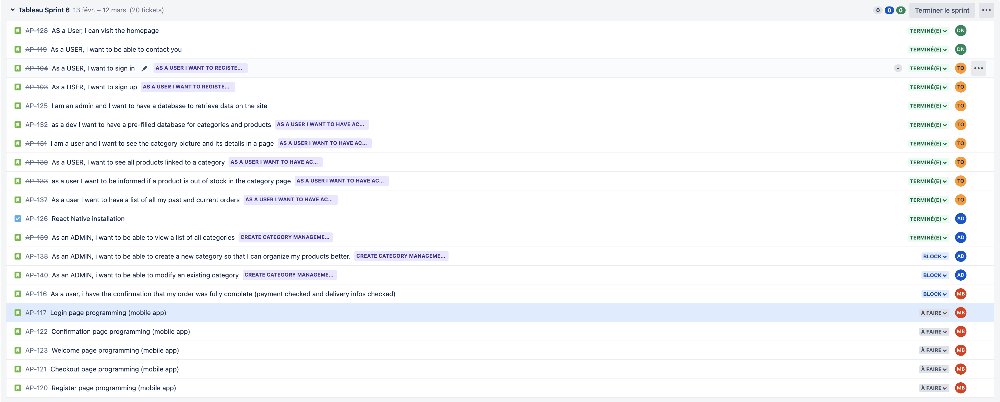

RAPPORT DE SPRINT 6

### _Activités générales :_

**DN :** Djibril NAJI / **TO :** Thomas Oliviera / **AD :** Alexis DUCHEMANN / **MB :** Myriam BENABDESSADOK

# Changelog

## **Djibril**

- [djibrilnaji] 872c2f5 2023-03-12 | AP-119 : add page contact and confirmation page + add route for api (origin/feature/AP-119-as-a-user-i-want-to-be-able-to-contact-you, feature/ AP-119-as-a-user-i-want-to-be-able-to-contact-you)
- [djibrilnaji] c7c5240 2023-03-12 | AP-119 : add form for contact
- [djibrilnaji] 6eb2e58 2023-03-12 | AP-119 : add migration for contact table
- [djibrilnaji] aa66774 2023-03-12 | AP-119 : add ContactModel
- [djibrilnaji] f515b80 2023-03-12 | AP-119 : Remove json useless
- [DjibrilNaji] a4a3f09 2023-03-07 | Merge pull request #48 from DjibrilNaji/feature/AP-133-product-out-stock-category-page
- [djibrilnaji] d42345a 2023-03-05 | AP-128 : remove filter in home page and update request with "where" (feature/AP-128-as-a-user-i-can-visit-the-homepage)
- [djibrilnaji] 030abd1 2023-03-05 | AP-128 : Correction to the request
- [djibrilnaji] d5b690f 2023-03-05 | AP-128 : update migration
- [djibrilnaji] 548ef51 2023-03-05 | AP-128 : update import because there are problems on Vercel with this import
- [djibrilnaji] 162bc57 2023-03-05 | AP-128 : Add endpoint for home page + improve home page and use api to display products and categories
- [djibrilnaji] 88255d5 2023-03-05 | Merge branch 'feature/AP-130-product-in-category-page' into feature/AP-128-as-a-user-i-can-visit-the-homepage
- [DjibrilNaji] 99b80a6 2023-03-05 | Merge pull request #46 from DjibrilNaji/feature/AP-130-product-in-category-page
- [DjibrilNaji] 01d7f57 2023-03-05 | Merge pull request #45 from DjibrilNaji/feature/AP-132-creation-seeder
- [DjibrilNaji] b313b89 2023-03-05 | Update 02products.js (feature/AP-132-creation-seeder)
- [DjibrilNaji] 6e1d144 2023-03-05 | Update 02products.js
- [DjibrilNaji] b8e993a 2023-03-05 | Update 02products.js
- [djibrilnaji] cf4595c 2023-03-04 | AP-128 : improve burger menu
- [djibrilnaji] 2e5b78f 2023-03-04 | AP-128 : add migration and model for imageHomePage
- [djibrilnaji] 83cf5f3 2023-03-02 | Merge remote-tracking branch 'origin/release/sprint6' into feature/AP-128-as-a-user-i-can-visit-the-homepage
- [djibrilnaji] 01c466c 2023-03-02 | Merge branch 'feature/AP-125-creation-migration-knex' into release/AP-128-as-a-user-i-can-visit-the-homepage
- [djibrilnaji] 0ae1296 2023-02-13 | Add sprint report (origin/release/sprint5, release/sprint5)

## **Thomas**

- [Thomas-De-Oliveira] 3158012 2023-03-12 | Merge pull request #53 from DjibrilNaji/feature/AP-138-as-an-admin-i-want-to-create-a-category (HEAD -> release/sprint6, origin/release/sprint6, origin/HEAD)
- [Thomas-De-Oliveira] 604ed4b 2023-03-12 | Merge pull request #52 from DjibrilNaji/feature/AP-119-as-a-user-i-want-to-be-able-to-contact-you
- [Thomas-De-Oliveira] 0213330 2023-03-11 | Merge pull request #51 from DjibrilNaji/feature/AP-140-as-an-admin-i-want-to-view-a-list-of-categories
- [Thomas-De-Oliveira] 8ef78c1 2023-03-07 | list orders for users (origin/feature/AP-137-list-order-for-user)
- [Thomas-De-Oliveira] c88d7cf 2023-03-07 | add seeder for users and orders
- [Thomas-De-Oliveira] fd1a40b 2023-03-07 | modify design category page + add out of stock context (feature/AP-133-product-out-stock-category-page)
- [Thomas-De-Oliveira] fb47b10 2023-03-06 | fix name image products in seed
- [Thomas-De-Oliveira] cffbea2 2023-03-05 | Merge pull request #47 from DjibrilNaji/feature/AP-128-as-a-user-i-can-visit-the-homepage
- [Thomas-De-Oliveira] 0e4f713 2023-03-05 | fix name category (feature/AP-130-product-in-category-page)
- [Thomas-De-Oliveira] f7f7bb2 2023-03-05 | fix seeder and migration
- [Thomas-De-Oliveira] 79f9594 2023-03-04 | fix name product
- [Thomas-De-Oliveira] 2698495 2023-03-04 | fix seed
- [Thomas-De-Oliveira] a7f8794 2023-03-03 | Addition of the list of products in the category
- [Thomas-De-Oliveira] fe496e0 2023-03-02 | add seeder for categories, products, materials, and imageProduct
- [Thomas-De-Oliveira] b5b1799 2023-03-01 | add page categorie with back and connexion to bucket aws (feature/AP-131-category-page-details-photo)
- [Thomas-De-Oliveira] 43f37ae 2023-02-28 | cleanliness of code (origin/feature/AP-125-creation-migration-knex, feature/AP-125-creation-migration-knex)
- [Thomas-De-Oliveira] 4a1830e 2023-02-27 | updating the backend and frontend relationship

## **Alexis**

- [Alexis Duchemann] 4e1a834 2023-03-12 | create catagory formik form
- [Alexis Duchemann] a5fc1a8 2023-03-12 | change admin import
- [Alexis Duchemann] 2fb3f73 2023-03-12 | change admin components directory
- [Alexis Duchemann] 060e8c4 2023-03-12 | create POST method in categories
- [Alexis Duchemann] c1eaf9f 2023-03-11 | created api call and list view for categories
- [Alexis Duchemann] a004539 2023-03-11 | deleted categories.jsx
- [Alexis Duchemann] a9a71f5 2023-03-11 | created api categories page
- [Alexis Duchemann] 01b02e6 2023-03-11 | fix button size
- [Alexis Duchemann] fd827f4 2023-03-09 | Merge pull request #49 from DjibrilNaji/feature/AP-137-list-order-for-user
- [Alexis Duchemann] 76708f9 2023-02-28 | Merge pull request #42 from DjibrilNaji/feature/AP-125-creation-migration-knex
- [Alexis Duchemann] ebd6ec4 2023-02-13 | Merge pull request #41 from DjibrilNaji/release/sprint5 (origin/main, release/AP-107-as-a-user-i-want-to-see-a-particular-product, main)

## **Myriam**

- [myrm02] fa03576 2023-03-02 | Merge pull request #43 from DjibrilNaji/feature/AP-131-category-page-details-photo

# _Rétrospective de sprint :_

> ## **Djibril**
>
> ### Avis Positifs :
>
> - Mes users storys pour ce sprint sont terminées, validées et mergées sur la branch principale.
>
> ### Avis négatifs :
>
> - Un peu de mal au début du sprint pour la compréhension de certaines chose en lien avec les API (au fur et à mesure tout à été compris)
>
> ### Questions:
>
> - Aucune question particulière

> ## **Thomas**
>
> ### Avis Positifs :
>
> - Mes users story pour ce sprint sont terminées, validée et mergée sur la branch principale.
> - J'ai eu très peu de problème avec la compréhension du code et pour l'expliquer aux autres membres du groupes.
> - La cohésion de groupe est bonne avec Djibril et Alexis.
>
> ### Avis négatifs :
>
> - Aucun avis négatifs
>
> ### Questions:
>
> - Aucune question particulière

> ## **Thomas & Djibril** :
>
> ### Idées d'améliorations:
>
> - Ajouté également l'envoie de mail pour la page contact avec la création d'une fausse boite mail Airnes
> - En backOffice pour les tableaux ajouté la possibilité de pouvoir de trier (exemple: ordre croissant / décroissant ) ajouté recemment

> ## **Alexis**
>
> Avis négatif :
>
> - Je n'ai pas pu finir l'user story car il manque l'upload d'image de la catégorie. (Ce problème sera régler au prochain sprint)
>
> ### Questions:
>
> - Aucune question particulière

> ## **Myriam**
>
> Avis négatif :
>
> - "J'avais juste eu quelques difficultés pour faire un responsive de sorte à ce que le message soit centré selon la taille de l'écran"
> - "Et là je rajouterai la partie back que j'ai du mal à me baser sur une url d'une autre page pour récupérer le numéro de commandes"
