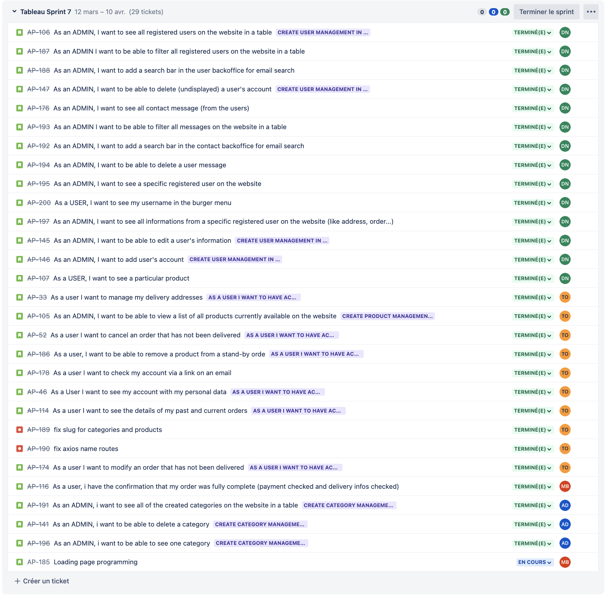

RAPPORT DE SPRINT 7

### _Activités générales :_

**DN :** Djibril NAJI / **TO :** Thomas Oliviera / **AD :** Alexis DUCHEMANN / **MB :** Myriam BENABDESSADOK

# Changelog

## **Djibril**

- [djibrilnaji] 7d0addd4 2023-04-10 | add page to see a particular product and add route (feature/AP-107-as-a-user-i-want-to-see-a-particular-product)
- [djibrilnaji] 3140b9b1 2023-04-10 | Revert "add products on the same category of the current product"
- [djibrilnaji] 3c7c1f01 2023-04-10 | remove useless import (feature/AP-146-as-an-admin-i-want-to-add-users-account)
- [djibrilnaji] 164f5f5b 2023-04-10 | add products on the same category of the current product
- [djibrilnaji] e5fc5446 2023-04-10 | add endpoint to get products by slug
- [djibrilnaji] 0242d870 2023-04-10 | add isMain in image_product
- [djibrilnaji] c3f2c732 2023-04-10 | Merge branch 'release/sprint7' into feature/AP-107-as-a-user-i-want-to-see-a-particular-product
- [djibrilnaji] 0c4ff20e 2023-04-10 | add regex for password (feature/AP-145-as-an-admin-i-want-to-be-able-to-edit-a-users-information)
- [djibrilnaji] 5b4063b8 2023-04-10 | update view to replace User form with editUserForm
- [djibrilnaji] 93d7ceb8 2023-04-10 | add isAdmin and password in endpoint
- [djibrilnaji] 93c7821d 2023-04-10 | add condition to display the submit button + add props for the button name
- [djibrilnaji] ec48935e 2023-04-10 | add new Form only for edit user for admin
- [djibrilnaji] b4b731e7 2023-04-10 | remove isAdmin in endpoint
- [djibrilnaji] 60fbaab4 2023-04-10 | add page for the userForm
- [djibrilnaji] 6d49eea6 2023-04-10 | add endpoint for create user
- [djibrilnaji] 7f33bfbe 2023-04-10 | add user form
- [djibrilnaji] 58a807c7 2023-04-10 | Add button to redirect on the UserAdminForm + add routes
- [djibrilnaji] 57c8bd98 2023-04-10 | Add back button components and refactor all files with this button
- [djibrilnaji] 6f283265 2023-04-10 | display address + billingAddress + Orders (feature/AP-197-as-an-admin-i-want-to-see-all-informations-from-a-specific-registered-user-on-the-website-like-address-order)
- [djibrilnaji] c777e0c0 2023-04-10 | add condition to check if window exist (origin/feature/AP-200-as-a-user-i-want-to-see-my-username-in-the-burger-menu, feature/AP-200-as-a-user-i-want-to-see-my-username-in-the-burger-menu)
- [djibrilnaji] 0f009760 2023-04-09 | add username in burger menu
- [djibrilnaji] 7ca9d136 2023-04-09 | add endpoint to edit user + add function in view
- [djibrilnaji] 1ff1716b 2023-04-09 | Add display name (feature/AP-196-as-an-admin-i-want-to-see-a-specific-registered-user-on-the-website)
- [DjibrilNaji] bfc6de1e 2023-04-09 | Merge pull request #76 from DjibrilNaji/feature/AP-196-as-an-admin-i-want-to-be-able-to-delete-a-category
- [djibrilnaji] b6ab8204 2023-04-09 | remove update for an other branch
- [djibrilnaji] 60232271 2023-04-09 | add new form and formField for just Admin
- [djibrilnaji] 794adbbf 2023-04-09 | update button and submit button
- [djibrilnaji] c8a6bd84 2023-04-09 | add user form + handleSubmit
- [djibrilnaji] 8e98aaf1 2023-04-09 | add toggle for update + add button to go back
- [djibrilnaji] 9186088e 2023-04-09 | add routes to redirect on specific user frm user page
- [djibrilnaji] a79663ea 2023-04-09 | add view for specific user in BO
- [djibrilnaji] d5efbacc 2023-04-09 | add endpoint for specific user
- [djibrilnaji] ef1ab28f 2023-04-09 | Revert "add endpoint for get specific user"
- [djibrilnaji] 2d0a0f0b 2023-04-09 | add route
- [djibrilnaji] 4cc9d0c6 2023-04-09 | add endpoint for get specific user
- [DjibrilNaji] 82575e78 2023-04-09 | Merge pull request #71 from DjibrilNaji/feature/AP-33-user-manage-delivery-address
- [djibrilnaji] 2a1516e0 2023-04-08 | add delete icon and button to delete all checked messages (feature/AP-194-as-an-admin-i-want-to-be-able-to-delete-a-user-message)
- [djibrilnaji] 1c0ef02f 2023-04-08 | add searche bar for email (feature/AP-192-as-an-admin-i-want-to-add-a-search-bar-in-the-contact-backoffice-for-email-search)
- [djibrilnaji] f5f45124 2023-04-08 | add select to choose how many messages can be visble and add handle sortChange (feature/AP-193-as-an-admin-i-want-to-be-able-to-filter-all-messages-on-the-website-in-a-table)
- [djibrilnaji] 220c1c54 2023-04-08 | add sortColumn to choose column
- [djibrilnaji] 2ec1a748 2023-04-08 | add seed for contact
- [djibrilnaji] 20bb6101 2023-04-08 | Add contact pages for admin (feature/AP-176-as-an-admin-i-want-to-see-all-contact-message-from-the-users)
- [djibrilnaji] 78fa7d3d 2023-04-08 | add get contact endpoint
- [djibrilnaji] 7f7aa703 2023-04-08 | Add route in navAdmin
- [djibrilnaji] 0c446d79 2023-04-08 | add modifiers in contact model
- [djibrilnaji] ce9e36f8 2023-04-04 | Merge branch 'release/sprint7' into feature/AP-107-as-a-user-i-want-to-see-a-particular-product
- [DjibrilNaji] 668d7245 2023-04-04 | Merge pull request #69 from DjibrilNaji/feature/AP-190-fix-axios-name-routes
- [djibrilnaji] 67360f18 2023-04-04 | Merge branch 'release/sprint7' into feature/AP-107-as-a-user-i-want-to-see-a-particular-product
- [DjibrilNaji] c56869a6 2023-04-04 | Merge pull request #68 from DjibrilNaji/feature/AP-189-fix-slug-categories-and-products
- [djibrilnaji] ae1f0236 2023-04-04 | remove users because is never used (feature/AP-147-as-an-admin-i-want-to-be-able-to-delete-undisplayed-a-users-account)
- [djibrilnaji] 589634c8 2023-04-04 | rename const to userDeleted
- [djibrilnaji] d6b60a6b 2023-04-04 | rename endpoint
- [djibrilnaji] 456b3f26 2023-04-04 | Remove the alert for the moment
- [djibrilnaji] 0798f5ad 2023-04-04 | update margin
- [djibrilnaji] 90f0a090 2023-04-04 | add button at the bottom to delete several users + add delete button on table to delete one by one
- [djibrilnaji] 98fa5009 2023-04-04 | Add endpoint for undisplaying users + update endpoint to use a default sortColumn
- [djibrilnaji] cbe9f2ca 2023-04-04 | Update style for responsive
- [djibrilnaji] e943c373 2023-04-04 | Merge branch 'release/sprint7' into feature/AP-147-as-an-admin-i-want-to-be-able-to-delete-undisplayed-a-users-account
- [djibrilnaji] 0a92fda9 2023-04-01 | add active <th> (feature/AP-188-as-an-admin-i-want-to-add-a-search-bar-in-the-user-backoffice-for-email-search)
- [djibrilnaji] 67860d8a 2023-04-01 | AP-188 : Add search input for email
- [djibrilnaji] a96f70fb 2023-03-31 | add filter with an icon in table +add possibility to manage limit (feature/AP-187-as-an-admin-i-want-to-be-able-to-filter-all-registered-users-on-the-website-in-a-table)
- [djibrilnaji] 5c17aed1 2023-03-31 | add active or inactive account (feature/AP-106-as-an-admin-i-want-to-see-all-registered-users-on-the-website-in-a-table)
- [djibrilnaji] 60b43eb0 2023-03-31 | remove filter
- [djibrilnaji] bbf4b956 2023-03-29 | add boolean for isAdmin and isDelete
- [djibrilnaji] a182794d 2023-03-29 | add random for isAdmin and isDelete
- [djibrilnaji] 0e2ccd34 2023-03-29 | add table for see users
- [djibrilnaji] 14fdd0fb 2023-03-29 | add migration and update seed
- [djibrilnaji] 59807c0a 2023-03-29 | add endpoint for get user
- [djibrilnaji] 5d7f195b 2023-03-29 | remove user file
- [djibrilnaji] 15615a5c 2023-03-29 | little update
- [djibrilnaji] da1f1cea 2023-03-29 | add condition for only admin can be able to view the admin button in navbar
- [djibrilnaji] b1c88b42 2023-03-29 | Add pagination
- [DjibrilNaji] e321802f 2023-03-29 | Merge pull request #58 from DjibrilNaji/AP-46-user-see-personal-data
- [djibrilnaji] 5a9558b5 2023-03-12 | Add sprint report (origin/release/sprint6, origin/HEAD, release/sprint6)

## **Thomas**

- [Thomas-De-Oliveira] bbb40de5 2023-04-09 | fix code (feature/AP-33-user-manage-delivery-address)
- [Thomas-De-Oliveira] 3339b2c1 2023-04-09 | fix routes delete
- [Thomas-De-Oliveira] 145b4147 2023-04-09 | change route address
- [Thomas-De-Oliveira] 8c8ef23a 2023-04-09 | Merge branch 'release/sprint7' into feature/AP-33-user-manage-delivery-address
- [Thomas-De-Oliveira] a3c4313e 2023-04-09 | fix name routes
- [Thomas-De-Oliveira] c3659e06 2023-04-08 | fix bug
- [Thomas-De-Oliveira] bd993fb6 2023-04-08 | Merge pull request #75 from DjibrilNaji/feature/AP-194-as-an-admin-i-want-to-be-able-to-delete-a-user-message
- [Thomas-De-Oliveira] 438f4027 2023-04-08 | Merge pull request #74 from DjibrilNaji/feature/AP-192-as-an-admin-i-want-to-add-a-search-bar-in-the-contact-backoffice-for-email-search
- [Thomas-De-Oliveira] 759a44c7 2023-04-08 | Merge pull request #73 from DjibrilNaji/feature/AP-193-as-an-admin-i-want-to-be-able-to-filter-all-messages-on-the-website-in-a-table
- [Thomas-De-Oliveira] 4dc56570 2023-04-08 | Merge pull request #72 from DjibrilNaji/feature/AP-176-as-an-admin-i-want-to-see-all-contact-message-from-the-users
- [Thomas-De-Oliveira] e4ca8281 2023-04-08 | Merge pull request #70 from DjibrilNaji/feature/AP-191-as-an-admin-i-want-to-see-all-the-categories
- [Thomas-De-Oliveira] 376cf5ed 2023-04-08 | delete address delivery
- [Thomas-De-Oliveira] da876375 2023-04-08 | user can add a new delivery address
- [Thomas-De-Oliveira] 31735806 2023-04-08 | add update address delivery
- [Thomas-De-Oliveira] c3095015 2023-04-08 | Merge branch 'release/sprint7' into feature/AP-33-user-manage-delivery-address
- [Thomas-De-Oliveira] 2dfbf2e0 2023-04-05 | fix delete one by one product
- [Thomas-De-Oliveira] 0773c7f1 2023-04-05 | fix name routes
- [Thomas-De-Oliveira] 1d1dde60 2023-04-05 | fix myAccount file
- [Thomas-De-Oliveira] af5dd0b3 2023-04-05 | Merge branch 'release/sprint7' into feature/AP-33-user-manage-delivery-address
- [Thomas-De-Oliveira] 849d0051 2023-04-05 | Merge branch 'release/sprint7' into feature/AP-33-user-manage-delivery-address
- [Thomas-De-Oliveira] 9cfd5157 2023-04-05 | reformat file numberOrder.jsx
- [Thomas-De-Oliveira] d871ce60 2023-04-05 | Merge branch 'feature/AP-186-user-want-cancel-order' of github.com:DjibrilNaji/airnes-projet-sdv-b3 into feature/AP-186-user-want-cancel-order
- [Thomas-De-Oliveira] dbfdfd04 2023-04-05 | fix login and register
- [Thomas-De-Oliveira] ea7f5299 2023-04-04 | Merge branch 'release/sprint7' into feature/AP-190-fix-axios-name-routes (feature/AP-190-fix-axios-name-routes)
- [Thomas-De-Oliveira] 0d21b319 2023-04-04 | add slug (feature/AP-189-fix-slug-categories-and-products)
- [Thomas-De-Oliveira] 6b7f21c6 2023-04-04 | fix route
- [Thomas-De-Oliveira] 7dd1c2a1 2023-04-04 | fix axios routes with base url config
- [Thomas-De-Oliveira] 38295104 2023-04-04 | modify axios routes
- [Thomas-De-Oliveira] 7af2e415 2023-04-04 | Merge pull request #67 from DjibrilNaji/feature/AP-147-as-an-admin-i-want-to-be-able-to-delete-undisplayed-a-users-account
- [Thomas-De-Oliveira] 2ba7121f 2023-04-04 | Merge pull request #65 from DjibrilNaji/feature/AP-147-as-an-admin-i-want-to-be-able-to-delete-undisplayed-a-users-account
- [Thomas-De-Oliveira] 7d2abd73 2023-04-04 | admin see all products
- [Thomas-De-Oliveira] e7441c64 2023-04-04 | fix slug for categories and products (origin/fix-slug-for-categories-and-products, fix-slug-for-categories-and-products)
- [Thomas-De-Oliveira] f587f677 2023-04-03 | user can cancel order on stand by (feature/AP-186-user-want-cancel-order)
- [Thomas-De-Oliveira] 201ecd9b 2023-04-03 | create file debounce
- [Thomas-De-Oliveira] cdc6a16d 2023-04-03 | delete product from order
- [Thomas-De-Oliveira] c465016a 2023-04-03 | fix code with new columns
- [Thomas-De-Oliveira] cabe963b 2023-04-03 | update table and seed
- [Thomas-De-Oliveira] c262b4e7 2023-04-01 | Merge pull request #62 from DjibrilNaji/feature/AP-188-as-an-admin-i-want-to-add-a-search-bar-in-the-user-backoffice-for-email-search
- [Thomas-De-Oliveira] 521818a9 2023-04-01 | page address for update
- [Thomas-De-Oliveira] f9f30fa8 2023-04-01 | add table address for user
- [Thomas-De-Oliveira] 7e80f937 2023-04-01 | Merge pull request #61 from DjibrilNaji/feature/AP-187-as-an-admin-i-want-to-be-able-to-filter-all-registered-users-on-the-website-in-a-table
- [Thomas-De-Oliveira] b9cb25d9 2023-03-31 | Merge pull request #59 from DjibrilNaji/feature/AP-106-as-an-admin-i-want-to-see-all-registered-users-on-the-website-in-a-table
- [Thomas-De-Oliveira] 375b0428 2023-03-31 | Merge pull request #60 from DjibrilNaji/feature/AP-116-confirmation-message-page
- [Thomas-De-Oliveira] a24bc547 2023-03-31 | see address data with select
- [Thomas-De-Oliveira] b06fb4f3 2023-03-30 | fix problem with name table
- [Thomas-De-Oliveira] eaeb20ca 2023-03-29 | delete file auth
- [Thomas-De-Oliveira] 91cb3d77 2023-03-29 | modify email by token in url confirmation
- [Thomas-De-Oliveira] 06defd58 2023-03-29 | add update possibilty (AP-46-user-see-personal-data)
- [Thomas-De-Oliveira] 78cc8ab2 2023-03-29 | start update personnal data
- [Thomas-De-Oliveira] 6b9a8a1e 2023-03-28 | add sendGrid mail and add verification mail after sign up
- [Thomas-De-Oliveira] 6714a1d0 2023-03-27 | Possibility for the user to modify the quantity of the product ordered
- [Thomas-De-Oliveira] 65fa8996 2023-03-15 | add billing address and delivery address
- [Thomas-De-Oliveira] dcfa17d6 2023-03-15 | first commit can see products details, amount and tva
- [Thomas-De-Oliveira] 27f4ac33 2023-03-12 | Merge pull request #54 from DjibrilNaji/release/sprint6 (origin/main)

## **Alexis**

- [Alexis Duchemann] 8c852a2d 2023-04-10 | Merge pull request #84 from DjibrilNaji/feature/AP-107-as-a-user-i-want-to-see-a-particular-product (HEAD -> release/sprint7, origin/release/sprint7)
- [Alexis Duchemann] 9df789b4 2023-04-10 | Merge pull request #82 from DjibrilNaji/feature/AP-146-as-an-admin-i-want-to-add-users-account
- [Alexis Duchemann] 675df6ff 2023-04-10 | Merge branch 'release/sprint7' into feature/AP-146-as-an-admin-i-want-to-add-users-account
- [Alexis Duchemann] 40ef1b97 2023-04-10 | Merge pull request #83 from DjibrilNaji/feature/AP-145-as-an-admin-i-want-to-be-able-to-edit-a-users-information
- [Alexis Duchemann] e9a9f3ed 2023-04-10 | Merge pull request #81 from DjibrilNaji/feature/AP-197-as-an-admin-i-want-to-see-all-informations-from-a-specific-registered-user-on-the-website-like-address-order
- [Alexis Duchemann] f2ef6229 2023-04-10 | Merge pull request #80 from DjibrilNaji/feature/AP-200-as-a-user-i-want-to-see-my-username-in-the-burger-menu
- [Alexis Duchemann] ded9a7eb 2023-04-09 | Merge pull request #79 from DjibrilNaji/feature/AP-145-as-an-admin-i-want-to-be-able-to-edit-a-users-information
- [Alexis Duchemann] b089b2cc 2023-04-09 | Merge pull request #77 from DjibrilNaji/feature/AP-196-as-an-admin-i-want-to-see-a-specific-registered-user-on-the-website
- [Alexis Duchemann] 1cb5f033 2023-04-09 | fix delete all categories related produtcs (feature/AP-196-as-an-admin-i-want-to-be-able-to-delete-a-category)
- [Alexis Duchemann] 63499e1c 2023-04-09 | added handleDelete
- [Alexis Duchemann] c9ab93e7 2023-04-09 | added api route to delete
- [Alexis Duchemann] 271c15d1 2023-04-09 | added delete for categories in knex
- [Alexis Duchemann] c2720448 2023-04-08 | added categories admin page (feature/AP-191-as-an-admin-i-want-to-see-all-the-categories)
- [Alexis Duchemann] 4fb5eb92 2023-04-08 | categories api admin route update
- [Alexis Duchemann] ba19f34e 2023-04-08 | added modifiers to CategoryModel
- [Alexis Duchemann] 33e49f4b 2023-04-05 | Merge pull request #66 from DjibrilNaji/feature/AP-105-admin-want-see-all-products
- [Alexis Duchemann] 0178b1ab 2023-04-05 | Merge pull request #63 from DjibrilNaji/feature/AP-186-user-want-cancel-order
- [Alexis Duchemann] 7f6c45f8 2023-04-04 | Merge branch 'release/sprint7' into feature/AP-186-user-want-cancel-order
- [Alexis Duchemann] 1091b235 2023-03-30 | Merge pull request #56 from DjibrilNaji/feature/AP-174-user-modify-order-not-delivered

## **Myriam**

- [Myriam BENABDESSADOK] 547b056f 2023-03-31 | isPublic deleted
- [Myriam BENABDESSADOK] 2f619e80 2023-03-31 | useEffect serverGet correction
- [Myriam BENABDESSADOK] 13108b96 2023-03-31 | Extraction orderNumber correction
- [Myriam BENABDESSADOK] aa6b465b 2023-03-31 | Number of order extraction
- [myrm02] e039ccc0 2023-03-30 | Merge pull request #57 from DjibrilNaji/feature/AP-178-verify-email-sign-up
- [myrm02] 9e2aa94f 2023-03-30 | Merge branch 'release/sprint7' into feature/AP-178-verify-email-sign-up (origin/feature/AP-178-verify-email-sign-up)
- [Myriam BENABDESSADOK] 9680c82e 2023-03-30 | Merge branch 'release/sprint7' into feature/AP-116-confirmation-message-page
- [myrm02] a3e8414b 2023-03-19 | Merge pull request #55 from DjibrilNaji/feature/AP-114-details-past-current-order
- [Myriam BENABDESSADOK] 231d1c69 2023-03-12 | First try extraction of order number

# _Rétrospective de sprint :_

> ## **Djibril**
>
> ### Avis Positifs :
>
> - Mes users storys pour ce sprint sont terminées, validées et mergées sur la branch principale.
> - J'ai fais une très grosse partie du Back office qui nous permettra d'avancer sur autre chose durant les autres sprint
>
> ### Avis négatifs :
>
> - Aucun avis négatif
>
> ### Questions:
>
> - Aucune question particulière

> ## **Thomas**
>
> ### Avis Positifs :
>
> - Nous avons bien avancer sur le projet
> - J'ai réussi à produire une dizaine de ticket
> - Djibril a fourni un travail très qualitatif pour le BO
>
> ### Avis négatifs :
>
> - Je n'ai pas réussi a atteindre tous les objectifs que je m'étais fixer pour ce sprint
> - J'ai pris du temps et bloquer longtemps pour la page Mon compte pour lequelle il me reste encore quelques éléments à terminer
>
> ### Questions:
>
> - Je n'ai pas de question particulière sur ce sprint.

> ## **Alexis**
>
> Rien à dire par rapport à ce sprint

> ## **Myriam**
>
> Rien à dire par rapport à ce sprint
