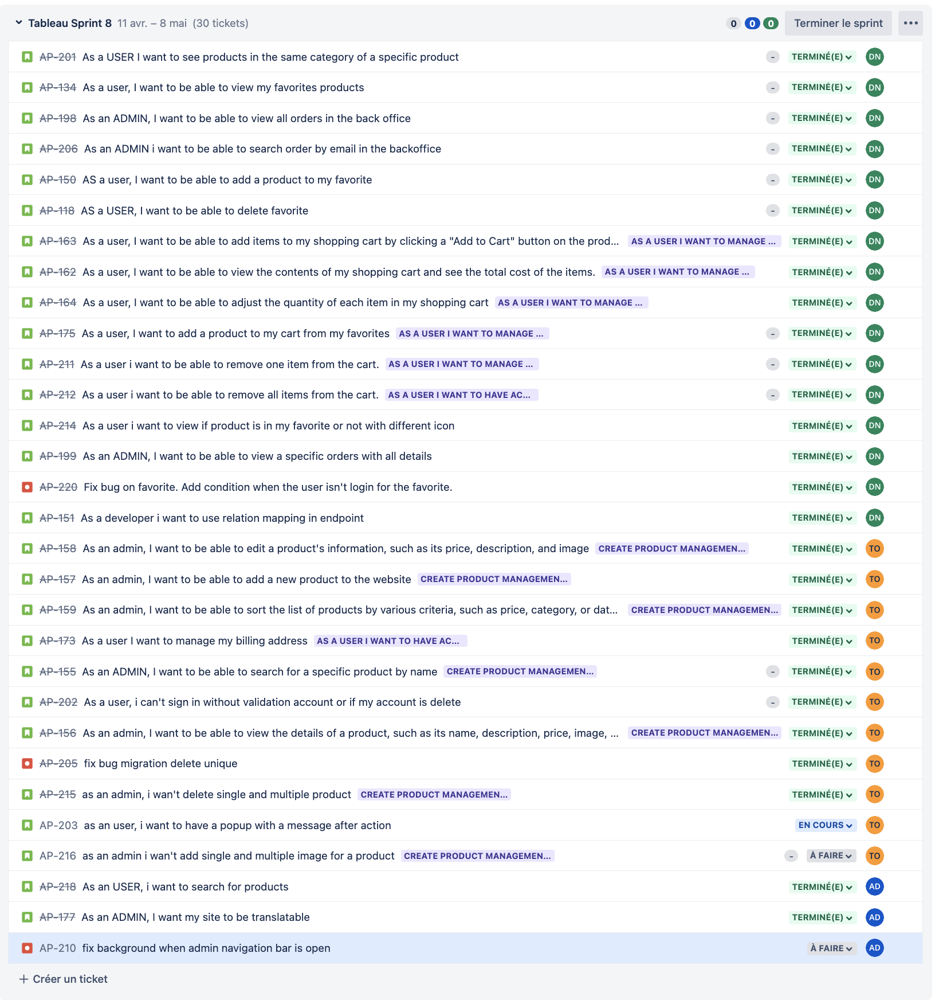

RAPPORT DE SPRINT 8

### _Activités générales :_

**DN :** Djibril NAJI / **TO :** Thomas Oliviera / **AD :** Alexis DUCHEMANN / **MB :** Myriam BENABDESSADOK

# Changelog

## **Djibril**

- [djibrilnaji] ed446271 2023-05-08 | remove id because it was for test (origin/feature/AP-151-as-a-developer-i-want-to-use-relation-mapping-in-endpoint, feature/AP-151-as-a-developer-i-want-to-use-relation-mapping-in-endpoint)
- [djibrilnaji] c682c69b 2023-05-08 | fix bug with delete favorite
- [djibrilnaji] 65f4b19b 2023-05-08 | user relations mapping instead of inner join in api for specific user
- [djibrilnaji] fa57954a 2023-05-08 | user relations mapping instead of inner join in api for specific order
- [djibrilnaji] 19e418e0 2023-05-08 | user relations mapping instead of inner join in api for orders
- [djibrilnaji] 727b8169 2023-05-08 | user relations mapping instead of inner join in api for products
- [djibrilnaji] 55fb9e9d 2023-05-08 | user relations mapping instead of inner join in api for favorites
- [DjibrilNaji] d1039b4c 2023-05-08 | Merge pull request #109 from DjibrilNaji/feature/AP-177-as-an-admin-i-want-my-site-to-be-translatable
- [DjibrilNaji] d1039b4c 2023-05-08 | Merge pull request #109 from DjibrilNaji/feature/AP-177-as-an-admin-i-want-my-site-to-be-translatable (HEAD -> release/sprint8, origin/release/sprint8)
- [djibrilnaji] 64de9158 2023-05-08 | Add condition to execute useEffect + add remove api call in the server side prop + fix bug (feature/AP-220-fix-bug-on-favorite-add-condition-when-the-user-isnt-login-for-the-favorite)
- [DjibrilNaji] 06028395 2023-05-06 | Merge pull request #106 from DjibrilNaji/feature/AP-211-as-an-user-i-want-to-search-for-products
- [djibrilnaji] 75106190 2023-05-05 | view specific order in page (feature/AP-199-as-an-admin-i-want-to-be-able-to-view-a-specific-orders-with-all-details)
- [djibrilnaji] e6a5813d 2023-05-05 | add endpoint to get specific order
- [djibrilnaji] e1d28e8b 2023-05-05 | Rename model
  -- [djibrilnaji] 34492f44 2023-05-05 | Rename file with Model at the end
- [djibrilnaji] 64ea752f 2023-05-05 | add routes for specific order
- [djibrilnaji] f4c993f9 2023-05-01 | display icon different if is in favorite or not (feature/AP-214-as-a-user-i-want-to-view-if-product-is-in-my-favorite-or-not-with-different-icon)
- [djibrilnaji] d253d342 2023-05-01 | add new endpoint to get one product and check if is favorite or not
- [djibrilnaji] 1d7f42d3 2023-05-01 | rename old files
- [djibrilnaji] bcaec756 2023-05-01 | add function to add products in cart from favorite (feature/AP-175-as-a-user-i-want-to-add-a-product-to-my-cart-from-my-favorites)
- [djibrilnaji] c2ec21d2 2023-05-01 | use function on the front to remove all products (feature/AP-212-as-a-user-i-want-to-be-able-to-remove-all-items-from-the-cart)
- [djibrilnaji] c05b5d0c 2023-05-01 | add function to remove all items in the cart
- [djibrilnaji] 31188ed5 2023-04-30 | use function with button icon (feature/AP-211-as-a-user-i-want-to-be-able-to-remove-one-item-from-the-cart)
- [djibrilnaji] 4dc0197e 2023-04-30 | add functione to remove one
- [djibrilnaji] 299c195f 2023-04-30 | use function to manage quantity (feature/AP-164-as-a-user-i-want-to-be-able-to-adjust-the-quantity-of-each-item-in-my-shopping-cart)
- [djibrilnaji] 9d4d623e 2023-04-30 | Merge remote-tracking branch 'origin/release/sprint8' into release/sprint8
- [djibrilnaji] fe4ec43a 2023-04-30 | Revert "add function to remove quantity and update add to cart to add depending the quantity"
- [djibrilnaji] 8f1336af 2023-04-30 | add function in front and use them on the button
- [djibrilnaji] 67c2abb6 2023-04-30 | add function to remove quantity and update add to cart to add depending the quantity
- [djibrilnaji] acfbce85 2023-04-30 | add length in cart icon on the navbar (feature/AP-162-as-a-user-i-want-to-be-able-to-view-the-contents-of-my-shopping-cart-and-see-the-total-cost-of-the-items)
- [djibrilnaji] 2ad61319 2023-04-30 | add all function and use local storage to display cartitems
- [djibrilnaji] 7f2d2435 2023-04-30 | add truncate for description + add scrollbar webkit to remove scrollbar on thefront
- [djibrilnaji] 8f4ee637 2023-04-29 | update name of image (feature/AP-163-as-a-user-i-want-to-be-able-to-add-items-to-my-shopping-cart-by-clicking-a-add-to-cart-button-on-the-product-page)
- [djibrilnaji] 2632ac65 2023-04-29 | call function to add product in page + use it in the page
- [djibrilnaji] 228022d8 2023-04-29 | add context in app
- [djibrilnaji] 05eee7b5 2023-04-29 | add Modal to display message when add products in cart + rename other dialog
- [djibrilnaji] d30db9e6 2023-04-29 | add cart Context with function to add product in cart
- [djibrilnaji] 00d9750c 2023-04-29 | rename quantity of products to stock
- [djibrilnaji] beaffe03 2023-04-18 | fix a little bug (feature/AP-206-as-an-admin-i-want-to-be-able-to-search-order-by-email-in-the-backoffice)
- [djibrilnaji] 17716984 2023-04-18 | Add function to search by email
- [djibrilnaji] 5a232442 2023-04-18 | update style (feature/AP-198-as-an-admin-i-want-to-be-able-to-view-all-orders-in-the-back-office)
- [djibrilnaji] ff2e198f 2023-04-18 | create front for backoffice
- [djibrilnaji] 3d36683d 2023-04-18 | add routes + add in navbar
- [djibrilnaji] adc16393 2023-04-18 | add endpoint + update model
- [djibrilnaji] b3e40da0 2023-04-17 | Merge branch 'release/sprint8' into feature/AP-198-as-an-admin-i-want-to-be-able-to-view-all-orders-in-the-back-office
- [djibrilnaji] 526c884b 2023-04-17 | Add endpoint and function to delete favorites (feature/AP-118-as-a-user-i-want-to-be-able-to-delete-favorite)
- [djibrilnaji] cc72a0e9 2023-04-17 | add routes and add function for the button (feature/AP-150-as-a-user-i-want-to-be-able-to-add-a-product-to-my-favorite)
- [djibrilnaji] c72b5c7e 2023-04-17 | endpoint for add favorites
- [djibrilnaji] a118caa4 2023-04-17 | add userId in cookie
- [djibrilnaji] 516edd6b 2023-04-17 | add dialog for display message
- [djibrilnaji] 2b061013 2023-04-17 | Merge branch 'release/sprint8' into feature/AP-150-as-a-user-i-want-to-be-able-to-add-a-product-to-my-favorite
- [DjibrilNaji] 7373edfe 2023-04-17 | Merge pull request #92 from DjibrilNaji/feature/AP-205-fix-bug-migration-unique-email
- [djibrilnaji] 1e9979b8 2023-04-16 | Merge branch 'release/sprint8' into feature/AP-198-as-an-admin-i-want-to-be-able-to-view-all-orders-in-the-back-office
- [djibrilnaji] bd91475f 2023-04-16 | update style (feature/AP-134-as-a-user-i-want-to-be-able-to-view-my-favorites-products)
- [djibrilnaji] 3786ba69 2023-04-16 | add condition in endpoint
- [djibrilnaji] c1676540 2023-04-15 | Merge branch 'release/sprint8' into feature/AP-134-as-a-user-i-want-to-be-able-to-view-my-favorites-products
- [DjibrilNaji] 10b7011e 2023-04-15 | Merge pull request #89 from DjibrilNaji/feature/AP-202-user-cant-sign-if-not-valide-or-delete
- [DjibrilNaji] e4ce9d3a 2023-04-15 | Merge pull request #88 from DjibrilNaji/feature/AP-156-admin-want-see-more-details-for-products
- [djibrilnaji] d51630a2 2023-04-13 | update style
- [djibrilnaji] aff80ff8 2023-04-13 | remove unused value (feature/AP-201-as-a-user-i-want-to-see-products-in-the-same-category-of-a-specific-product)
- [djibrilnaji] 4216474c 2023-04-13 | replace code with component
- [djibrilnaji] 62e50e90 2023-04-13 | update size to remove scroll
- [djibrilnaji] b0139962 2023-04-13 | add try catch to check if there is an error or not
- [djibrilnaji] b0ee25fb 2023-04-13 | add custom error page
- [djibrilnaji] c10db09a 2023-04-13 | use findOne to don't have a 500 error
- [djibrilnaji] b783aa51 2023-04-13 | add condition for validate error
- [djibrilnaji] c3465c82 2023-04-12 | update seed
- [djibrilnaji] 2eb2e296 2023-04-12 | update style
- [djibrilnaji] be1d6779 2023-04-12 | seed to add favorites in tables
- [djibrilnaji] 7bd67a6b 2023-04-12 | Display favorites products on page
- [djibrilnaji] 6b2543cf 2023-04-12 | endpoint to get favorites products
- [djibrilnaji] dc16e2e8 2023-04-12 | model of favorite product
- [djibrilnaji] 4274e782 2023-04-12 | add url in navbar
- [djibrilnaji] 5338d72f 2023-04-12 | add routes for favorites
- [djibrilnaji] df303e53 2023-04-12 | add migrations for tables favorites
- [djibrilnaji] 387058d7 2023-04-11 | Display products in similar product div
- [djibrilnaji] 6769febb 2023-04-11 | add routes for slug products and categories
- [djibrilnaji] 19f75486 2023-04-11 | I retrieve products in same category and image of these products

## **Thomas**

- [Thomas-De-Oliveira] c09303a0 2023-05-03 | admin can delete single and multiple products (feature/AP-215-as-an-admin-i-want-delete-single-and-multiple-product)
- [Thomas-De-Oliveira] 6c665c8a 2023-05-01 | fix name material to unique in table (feature/AP-158-admin-want-manage-product)
- [Thomas-De-Oliveira] 7abd7cbf 2023-05-01 | fix manage product
- [Thomas-De-Oliveira] c329f7a2 2023-05-01 | Merge branch 'release/sprint8' into feature/AP-158-admin-want-manage-product
- [Thomas-De-Oliveira] a2013876 2023-05-01 | manage products from BO
- [Thomas-De-Oliveira] e15ccba9 2023-05-01 | Merge pull request #104 from DjibrilNaji/feature/AP-214-as-a-user-i-want-to-view-if-product-is-in-my-favorite-or-not-with-different-icon
- [Thomas-De-Oliveira] c7e2cc53 2023-05-01 | Merge pull request #103 from DjibrilNaji/feature/AP-175-as-a-user-i-want-to-add-a-product-to-my-cart-from-my-favorites
- [Thomas-De-Oliveira] 72c90f58 2023-04-30 | Merge pull request #100 from DjibrilNaji/feature/AP-164-as-a-user-i-want-to-be-able-to-adjust-the-quantity-of-each-item-in-my-shopping-cart
- [Thomas-De-Oliveira] f63f3fd2 2023-04-30 | Merge pull request #98 from DjibrilNaji/feature/AP-163-as-a-user-i-want-to-be-able-to-add-items-to-my-shopping-cart-by-clicking-a-add-to-cart-button-on-the-product-page
- [Thomas-De-Oliveira] 57ac70d9 2023-04-25 | add material in table
- [Thomas-De-Oliveira] d4740196 2023-04-22 | add column category in table (feature/AP-157-admin-want-add-new-product)
- [Thomas-De-Oliveira] 1276836b 2023-04-19 | add product with main Image
- [Thomas-De-Oliveira] 30555631 2023-04-17 | fix bug for table users (feature/AP-205-fix-bug-migration-unique-email)
- [Thomas-De-Oliveira] 6e748c12 2023-04-17 | Merge pull request #91 from DjibrilNaji/feature/AP-134-as-a-user-i-want-to-be-able-to-view-my-favorites-products
- [Thomas-De-Oliveira] 74a1f16c 2023-04-15 | add disabled for checkbox
- [Thomas-De-Oliveira] 759164bb 2023-04-15 | Merge pull request #90 from DjibrilNaji/feature/AP-201-as-a-user-i-want-to-see-products-in-the-same-category-of-a-specific-product
- [Thomas-De-Oliveira] d7d26292 2023-04-12 | user can't connect if is delete or invalidate
- [Thomas-De-Oliveira] 87e56a7f 2023-04-12 | add more details for products (feature/AP-156-admin-want-see-more-details-for-products)
- [Thomas-De-Oliveira] 7d6488dc 2023-04-12 | rename button
- [Thomas-De-Oliveira] a8670631 2023-04-12 | add a new billing address
  [- Thomas-De-Oliveira] 14aeb578 2023-04-12 | add update billing address

## **Alexis**

- Alexis Duchemann] a307950e 2023-05-08 | Merge pull request #111 from DjibrilNaji/feature/AP-151-as-a-developer-i-want-to-use-relation-mapping-in-endpoint (HEAD -> release/sprint8, origin/release/sprint8)
- [Alexis Duchemann] 6f8b7960 2023-05-08 | resolve double div
- [Alexis Duchemann] 65f366cc 2023-05-08 | Merge branch 'release/sprint8' into feature/AP-177-as-an-admin-i-want-my-site-to-be-translatable (feature/AP-177-as-an-admin-i-want-my-site-to-be-translatable)
- [Alexis Duchemann] b9ac1824 2023-05-08 | delete fix
- [Alexis Duchemann] c8a24b52 2023-05-08 | add direction (test) for ar, he
- [Alexis Duchemann] 09395156 2023-05-08 | remove all site direction
- [Alexis Duchemann] 7e00fd01 2023-05-08 | Merge pull request #110 from DjibrilNaji/feature/AP-220-fix-bug-on-favorite-add-condition-when-the-user-isnt-login-for-the-favorite
- [Alexis Duchemann] 08dcd57a 2023-05-07 | Merge pull request #107 from DjibrilNaji/feature/AP-215-as-an-admin-i-want-delete-single-and-multiple-product
- [Alexis Duchemann] d5e2e9ee 2023-05-07 | added code to use translation
- [Alexis Duchemann] 612e776d 2023-05-07 | added switch language
- [Alexis Duchemann] 586db2b0 2023-05-07 | direction + translation
- [Alexis Duchemann] 6255a956 2023-05-07 | create component to switch language
- [Alexis Duchemann] ad3d87d2 2023-05-07 | created locales translation files
- [Alexis Duchemann] 6e614caf 2023-05-07 | add config file for i18n
- [Alexis Duchemann] c17ca92b 2023-05-06 | remove see more (feature/AP-211-as-an-user-i-want-to-search-for-products)
- [Alexis Duchemann] 89e3b066 2023-05-06 | fix code
- [Alexis Duchemann] 2260a494 2023-05-06 | Merge pull request #108 from DjibrilNaji/feature/AP-199-as-an-admin-i-want-to-be-able-to-view-a-specific-orders-with-all-details
- [Alexis Duchemann] ad2e52b0 2023-05-06 | update model and image
- [Alexis Duchemann] 1af75b8e 2023-05-06 | Merge branch 'release/sprint8'
- [Alexis Duchemann] 81ba0936 2023-05-03 | Merge pull request #105 from DjibrilNaji/feature/AP-158-admin-want-manage-product
- [Alexis Duchemann] 48a25160 2023-05-03 | added search results
- [Alexis Duchemann] 102b13e7 2023-05-03 | product model
- [Alexis Duchemann] 97045a65 2023-05-03 | new routes
- [Alexis Duchemann] c4dfbe6e 2023-05-03 | added searchbar on navbar
- [Alexis Duchemann] 369f1ee0 2023-05-03 | created SearchBar component
- [Alexis Duchemann] 5ccf32eb 2023-05-01 | Merge pull request #102 from DjibrilNaji/feature/AP-212-as-a-user-i-want-to-be-able-to-remove-all-items-from-the-cart
- [Alexis Duchemann] 4aa041a2 2023-04-30 | Merge pull request #101 from DjibrilNaji/feature/AP-211-as-a-user-i-want-to-be-able-to-remove-one-item-from-the-cart
- Alexis Duchemann] b555a7e2 2023-04-30 | Merge pull request #99 from DjibrilNaji/feature/AP-162-as-a-user-i-want-to-be-able-to-view-the-contents-of-my-shopping-cart-and-see-the-total-cost-of-the-items
- [Alexis Duchemann] 626150da 2023-04-23 | Merge pull request #97 from DjibrilNaji/feature/AP-157-admin-want-add-new-product
- [Alexis Duchemann] 5db324ec 2023-04-23 | Merge branch 'release/sprint8' into feature/AP-157-admin-want-add-new-product
- [Alexis Duchemann] 6d9f20f7 2023-04-23 | Merge pull request #87 from DjibrilNaji/feature/AP-173-user-manage-billing-address
- [Alexis Duchemann] 58a15d15 2023-04-23 | Merge branch 'release/sprint8' into feature/AP-173-user-manage-billing-address
- [Alexis Duchemann] 9e64aa6f 2023-04-18 | Merge pull request #94 from DjibrilNaji/feature/AP-118-as-a-user-i-want-to-be-able-to-delete-favorite
- [Alexis Duchemann] bdcb7eac 2023-04-18 | Merge branch 'release/sprint8' into feature/AP-118-as-a-user-i-want-to-be-able-to-delete-favorite
- [Alexis Duchemann] afaa94e8 2023-04-18 | Merge pull request #93 from DjibrilNaji/feature/AP-150-as-a-user-i-want-to-be-able-to-add-a-product-to-my-favorite
- [Alexis Duchemann] 50016b01 2023-04-18 | Merge pull request #96 from DjibrilNaji/feature/AP-206-as-an-admin-i-want-to-be-able-to-search-order-by-email-in-the-backoffice
- [Alexis Duchemann] 6f721811 2023-04-18 | Merge pull request #95 from DjibrilNaji/feature/AP-198-as-an-admin-i-want-to-be-able-to-view-all-orders-in-the-back-office

## **Myriam**

Rien

# _Rétrospective de sprint :_

> ## **Djibril**
>
> ### Avis Positifs :
>
> - J’ai bien avancer sur mes tickets.
> - Je suis content de ce qu'a fourni Alexis, que se soit sur la recherche mais aussi sur le fait de pouvoir traduire le site.
>
> ### Avis négatifs :
>
> - Aucun avis négatif
>
> ### Questions et point :
>
> - Je pense qu'un gros rework serait à faire, pour bien utiliser les composants, pour nos endpoint, pour le style...

> ## **Thomas**
>
> ### Avis Positifs :
>
> - J’ai bien avancer sur mes tickets.
> - Surpris positivement par le travail fais par Alexis sur la recherche qui a bien débloquer une parti indécise du projet.
>
> ### Avis négatifs :
>
> - aucun point négatif
>
> ### Questions et point:
>
> - On devrait refaire une review sur notre code pour revoir l’utilisation d’objection en back.
>
> ## **Alexis**
>
> Je suis content d'avoir réussi la translation et la recherche pour ce sprint

> ## **Myriam**
>
> Rien à dire par rapport à ce sprint
