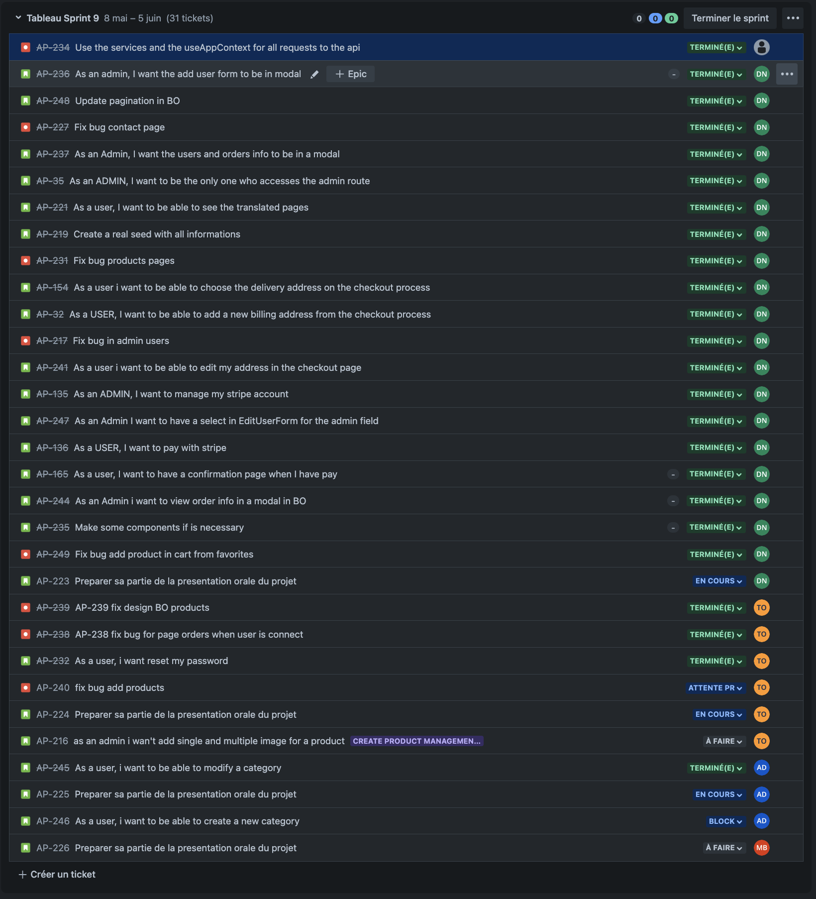

RAPPORT DE SPRINT 9

### _Activités générales :_

**DN :** Djibril NAJI / **TO :** Thomas Oliviera / **AD :** Alexis DUCHEMANN / **MB :** Myriam BENABDESSADOK

# Changelog

## **Djibril**

- [DjibrilNaji] 6b232014 2023-06-04 | Merge pull request #137 from DjibrilNaji/feature/AP-245-as-a-user-i-want-to-modify-a-category
- [djibrilnaji] aa8e31db 2023-06-04 | fix bug when add product in cart from favorite (origin/bug/AP-249-fix-bug-add-product-in-cart-from-favorites, bug/AP-249-fix-bug-add-product-in-cart-from-favorites)
- [djibrilnaji] 556d6a15 2023-06-04 | Add new pagination (feature/AP-248-update-pagination-in-bo)
- [djibrilnaji] 8e923a9f 2023-06-04 | Merge branch 'release/sprint9' into feature/AP-248-update-pagination-in-bo
- [djibrilnaji] ef40cb09 2023-06-04 | add navbar items components (feature/AP-235-make-some-components-if-is-necessary)
- [djibrilnaji] ea19c495 2023-06-04 | add empty page components
- [djibrilnaji] ea0c8a49 2023-06-04 | Add banner component and categories/products components
- [djibrilnaji] da00a2ef 2023-06-04 | Remove useless components
- [djibrilnaji] 952e13dc 2023-06-04 | Add select show component in admin page
- [djibrilnaji] 45d9ccaf 2023-06-04 | Merge branch 'release/sprint9' into feature/AP-235-make-some-components-if-is-necessary
- [djibrilnaji] 8011eaba 2023-06-04 | Add modal for order infos in BO (feature/AP-244-as-an-admin-i-want-to-view-order-info-in-a-modal-in-bo)
- [djibrilnaji] a3495774 2023-06-04 | Merge branch 'release/sprint9' into feature/AP-244-as-an-admin-i-want-to-view-order-info-in-a-modal-in-bo
- [djibrilnaji] 226fb8f4 2023-06-04 | Add confirmation page and remove all in cart after payment (feature/AP-165-as-a-user-i-want-to-have-a-confirmation-page-when-i-have-pay)
- [djibrilnaji] 188bfa6f 2023-06-04 | Merge branch 'release/sprint9' into feature/AP-165-as-a-user-i-want-to-have-a-confirmation-page-when-i-have-pay
- [djibrilnaji] 6cea6769 2023-06-04 | add select for admin in bo for edit user form (feature/AP-247-as-an-admin-i-want-to-have-a-select-in-edit-user-form-for-the-admin-field)
- [djibrilnaji] 750b2cac 2023-06-04 | add select for admin in bo for edit user form
- [djibrilnaji] f9f0822f 2023-06-03 | add stripe again for vercel error (feature/AP-136-as-a-user-i-want-to-pay-with-stripe)
- [djibrilnaji] f8a7d39a 2023-06-03 | add stripe in package.json for vercel
- [djibrilnaji] 731f24f9 2023-06-03 | add jwt condition to not access these pages if user is not logged in
- [djibrilnaji] 7afb2b73 2023-06-03 | add false confirmation page for the moment
- [djibrilnaji] a309853d 2023-06-03 | add services and use them in app context
- [djibrilnaji] 995a6045 2023-06-03 | add api call in checkout component for add new order get this order and add relation in relation table
- [djibrilnaji] e587c362 2023-06-03 | use props for checkout component
- [djibrilnaji] 1520d710 2023-06-03 | update delivery style
- [djibrilnaji] dcfb0c1e 2023-06-03 | add payment stripe endpoint
- [djibrilnaji] 45222d67 2023-06-03 | add post order and post relation order endpoint
- [djibrilnaji] cc283644 2023-06-03 | add productsIdQuantities to get id and quantity for relation table
- [djibrilnaji] 6d75b404 2023-06-03 | add style for checkout form
- [djibrilnaji] 7420ad31 2023-06-03 | add checkout component and use it in payment page
- [djibrilnaji] 4550a2c5 2023-06-03 | add routes for payment and confirmation
- [djibrilnaji] 8b18a087 2023-06-03 | add routes to go to the payment and add style for addresses
- [djibrilnaji] 267190f1 2023-06-03 | Rename variable with good name
- [djibrilnaji] 1a91a269 2023-06-03 | add the materials again
- [djibrilnaji] fce6191f 2023-06-02 | add form for edit on checkout (feature/AP-241-as-a-user-i-want-to-be-able-to-edit-my-address-in-the-checkout-page)
- [djibrilnaji] ebc30d2b 2023-06-02 | add 2 buttons for address form
- [djibrilnaji] c765613f 2023-06-02 | add translation for update button address
- [djibrilnaji] fa5df6a3 2023-06-02 | add gap in modal
- [djibrilnaji] bbf7a694 2023-06-02 | add translation for update address button
- [djibrilnaji] 4c7dd9a9 2023-06-02 | use delete for admin in BO (bug/AP-217-fix-bug-in-admin-users)
- [djibrilnaji] b55ecd01 2023-05-30 | add user form in a modal in admin page (feature/AP-236-as-an-admin-i-want-the-add-user-form-to-be-in-modal)
- [djibrilnaji] 75834586 2023-05-30 | Merge branch 'release/sprint9' into feature/AP-236-as-an-admin-i-want-the-add-user-form-to-be-in-modal
- [djibrilnaji] b5344a44 2023-05-30 | around price in cart (feature/AP-154-as-a-user-i-want-to-be-able-to-choose-the-delivery-address-on-the-checkout-process)
- [djibrilnaji] ab242a32 2023-05-29 | add new page for checkout, with all address and address form + card for cart info
- [djibrilnaji] c387ccdb 2023-05-29 | get default address in api
- [djibrilnaji] 65b7da0b 2023-05-29 | use new route in order number file
- [djibrilnaji] b9c1c523 2023-05-29 | add address form for checkout
- [djibrilnaji] 4d519580 2023-05-29 | add route in navbar
- [djibrilnaji] fb0cdadb 2023-05-29 | update cart page
- [djibrilnaji] a62af6d7 2023-05-29 | update modal to use this with children
- [djibrilnaji] 16527854 2023-05-29 | add getAddress in context
- [djibrilnaji] 32f44163 2023-05-29 | add component for cart card
- [djibrilnaji] 787691a3 2023-05-29 | add cart informations in state for use them in all site
- [djibrilnaji] 1367a480 2023-05-29 | add new routes
- [djibrilnaji] 0c92c2dd 2023-05-29 | remove useless page
- [djibrilnaji] a7a3b448 2023-05-29 | add all traduction for pages
- [djibrilnaji] bd8d9f4f 2023-05-29 | Merge branch 'release/sprint9' into feature/AP-154-as-a-user-i-want-to-be-able-to-choose-the-delivery-address-on-the-checkout-process
- [djibrilnaji] 0cddf839 2023-05-29 | Add all user info in a modal in admin (feature/AP-237-as-an-admin-i-want-the-users-and-orders-info-to-be-in-a-modal)
- [djibrilnaji] 85ca6c04 2023-05-27 | update all seeds with real informations (feature/AP-219-create-a-real-seed-with-all-informations)
- [djibrilnaji] 1a0e1794 2023-05-27 | add error when the user is not admin for the admin routes (feature/AP-35-as-an-admin-i-want-to-be-the-only-one-who-accesses-the-admin-route)
- [djibrilnaji] c6d3b7a9 2023-05-26 | update GSSP and use servie
- [djibrilnaji] b45fe6fc 2023-05-26 | update service for products page
- [djibrilnaji] 321f3b01 2023-05-26 | add services for home page
- [djibrilnaji] ab36a0ab 2023-05-23 | add services for products pages
- [djibrilnaji] f3e8d9fd 2023-05-22 | add services for favorites pages
- [djibrilnaji] 14a6eb3f 2023-05-22 | add services for post contact pages
- [djibrilnaji] 07155899 2023-05-22 | add services for /admin/users + admin/userId ... pages
- [djibrilnaji] 837c065e 2023-05-20 | add services for /admin/orders and /admin/orders/[orderId]/view page
- [djibrilnaji] bbd6d601 2023-05-20 | add services for /admin/contact page
- [djibrilnaji] b36223d6 2023-05-16 | update token and user because an error appears when i go to the product page and when i'm not login (bug/AP-231-fix-bug-products-pages)
- [djibrilnaji] d989101d 2023-05-16 | add translate for navigation in footer and burger menu (feature/AP-221-as-a-user-i-want-to-be-able-to-see-the-translated-pages)
- [djibrilnaji] 8cfd943b 2023-05-16 | add translate for contact confirmation page
- [djibrilnaji] 39061b25 2023-05-16 | add translate for contact page + for contact Form
- [djibrilnaji] ef546c27 2023-05-16 | add translate for product page + add direction on dialog
- [djibrilnaji] 7413660c 2023-05-16 | add translate for cart page
- [djibrilnaji] d941b01f 2023-05-16 | remove home page translate in common
- [djibrilnaji] d6b237d4 2023-05-16 | add translate for home-page
- [djibrilnaji] 515fdf3c 2023-05-16 | remove id + 1 because causes an error (bug/AP-227-fix-bug-contact-page)
- [djibrilnaji] 038044b0 2023-05-08 | add sprint report for sprint 8 (origin/release/sprint8, release/sprint8)
- [djibrilnaji] ed446271 2023-05-08 | remove id because it was for test (feature/AP-151-as-a-developer-i-want-to-use-relation-mapping-in-endpoint)
- [djibrilnaji] c682c69b 2023-05-08 | fix bug with delete favorite
- [djibrilnaji] 65f4b19b 2023-05-08 | user relations mapping instead of inner join in api for specific user
- [djibrilnaji] fa57954a 2023-05-08 | user relations mapping instead of inner join in api for specific order
- [djibrilnaji] 19e418e0 2023-05-08 | user relations mapping instead of inner join in api for orders
- [djibrilnaji] 727b8169 2023-05-08 | user relations mapping instead of inner join in api for products
- [djibrilnaji] 55fb9e9d 2023-05-08 | user relations mapping instead of inner join in api for favorites
- [DjibrilNaji] d1039b4c 2023-05-08 | Merge pull request #109 from DjibrilNaji/feature/AP-177-as-an-admin-i-want-my-site-to-be-translatable
- [djibrilnaji] 64de9158 2023-05-08 | Add condition to execute useEffect + add remove api call in the server side prop + fix bug (feature/AP-220-fix-bug-on-favorite-add-condition-when-the-user-isnt-login-for-the-favorite)

## **Thomas**

- [Thomas-De-Oliveira] ac30b364 2023-06-04 | add layout admin in create product page
- [Thomas-De-Oliveira] a9afaa97 2023-06-04 | delete price formatted in create api products
- [Thomas-De-Oliveira] a4fe3a73 2023-06-04 | Merge pull request #134 from DjibrilNaji/feature/AP-248-update-pagination-in-bo
- [Thomas-De-Oliveira] 456e1507 2023-06-04 | Merge pull request #131 from DjibrilNaji/feature/AP-165-as-a-user-i-want-to-have-a-confirmation-page-when-i-have-pay
- [Thomas-De-Oliveira] 8b3307a3 2023-06-04 | Merge pull request #130 from DjibrilNaji/feature/AP-247-as-an-admin-i-want-to-have-a-select-in-edit-user-form-for-the-admin-field
- [Thomas-De-Oliveira] 6f2bffdd 2023-06-04 | Merge pull request #128 from DjibrilNaji/feature/AP-136-as-a-user-i-want-to-pay-with-stripe
- [Thomas-De-Oliveira] 082599ca 2023-06-02 | add message after submit email
- [Thomas-De-Oliveira] f76f7bd3 2023-06-01 | fix design page BO product add modal for update
- [Thomas-De-Oliveira] b269a33d 2023-05-31 | Merge pull request #124 from DjibrilNaji/feature/AP-236-as-an-admin-i-want-the-add-user-form-to-be-in-modal
- [Thomas-De-Oliveira] 3419d737 2023-05-30 | Merge pull request #122 from DjibrilNaji/feature/AP-154-as-a-user-i-want-to-be-able-to-choose-the-delivery-address-on-the-checkout-process
- [Thomas-De-Oliveira] bd9ac46d 2023-05-30 | Merge branch 'release/sprint9' into feature/AP-154-as-a-user-i-want-to-be-able-to-choose-the-delivery-address-on-the-checkout-process
- [Thomas-De-Oliveira] f960fb13 2023-05-30 | reset password for user
- [Thomas-De-Oliveira] b7793483 2023-05-30 | Merge pull request #120 from DjibrilNaji/feature/AP-237-as-an-admin-i-want-the-users-and-orders-info-to-be-in-a-modal
- [Thomas-De-Oliveira] 1978cbcb 2023-05-28 | fix orders and delete possibility to modify and delete a product from order (AP-238-ap-238-fix-bug-for-page-orders-when-user-is-connect)
- [Thomas-De-Oliveira] a642dcb9 2023-05-28 | Merge pull request #119 from DjibrilNaji/feature/AP-35-as-an-admin-i-want-to-be-the-only-one-who-accesses-the-admin-route
- [Thomas-De-Oliveira] fa021ecd 2023-05-28 | Merge pull request #118 from DjibrilNaji/feature/AP-219-create-a-real-seed-with-all-informations
- [Thomas-De-Oliveira] eb9c5135 2023-05-26 | fix redirection
- [Thomas-De-Oliveira] a0542cc9 2023-05-25 | fix get in serverSideProps with service
- [Thomas-De-Oliveira] 251d9aaa 2023-05-25 | fix request get
- [Thomas-De-Oliveira] 5c9a487c 2023-05-23 | fix favorites and other api authorization
- [Thomas-De-Oliveira] 91c5abc6 2023-05-20 | return previous fix
- [Thomas-De-Oliveira] d04d2b72 2023-05-20 | fix appContextProvider
- [Thomas-De-Oliveira] 790ad2c6 2023-05-20 | fix materials change
- [Thomas-De-Oliveira] f6702603 2023-05-20 | fix bug id billing and name image
- [Thomas-De-Oliveira] d4e3b0e5 2023-05-19 | fix add product and add main Image request
- [Thomas-De-Oliveira] 6c43fbc5 2023-05-19 | fix see detail one product and update product
- [Thomas-De-Oliveira] dd00a7a8 2023-05-19 | fix admin products get and delete
- [Thomas-De-Oliveira] 25cfb7dd 2023-05-19 | fix page category request
- [Thomas-De-Oliveira] e8a2b147 2023-05-19 | fix all request my account
- [Thomas-De-Oliveira] b98d65f6 2023-05-19 | fix add address and add billing address
- [Thomas-De-Oliveira] 97788b5b 2023-05-19 | fix modify and delete address
- [Thomas-De-Oliveira] 23c65e5d 2023-05-19 | fix get address and modify mw
- [Thomas-De-Oliveira] 0057324f 2023-05-18 | fix list orders
- [Thomas-De-Oliveira] de7c54bb 2023-05-18 | fix get order detail and cancel order
- [Thomas-De-Oliveira] 33973676 2023-05-18 | fix update quantity and delete product from order

## **Alexis**

- [Alexis Duchemann] f5f22c8e 2023-06-04 | Merge pull request #136 from DjibrilNaji/bug/AP-249-fix-bug-add-product-in-cart-from-favorites (HEAD -> release/sprint9, origin/release/sprint9)
- [Alexis Duchemann] 93398bd5 2023-06-04 | Merge pull request #138 from DjibrilNaji/AP-240-fix-bug-create-product
- [Alexis Duchemann] ea7c83e8 2023-06-04 | add modal to update and see one cat (feature/AP-245-as-a-user-i-want-to-modify-a-category)
- [Alexis Duchemann] 8b91cf29 2023-06-04 | service in context
- [Alexis Duchemann] d5dc6d70 2023-06-04 | create services and api for get, patch single cat
- [Alexis Duchemann] a8538af5 2023-06-04 | Merge pull request #133 from DjibrilNaji/feature/AP-235-make-some-components-if-is-necessary
- [Alexis Duchemann] e5503dfe 2023-06-04 | Merge pull request #132 from DjibrilNaji/feature/AP-244-as-an-admin-i-want-to-view-order-info-in-a-modal-in-bo
- [Alexis Duchemann] d6e58fa8 2023-06-02 | Merge pull request #127 from DjibrilNaji/feature/AP-241-as-a-user-i-want-to-be-able-to-edit-my-address-in-the-checkout-page
- [Alexis Duchemann] 82d6383c 2023-06-02 | Merge branch 'release/sprint9' into feature/AP-241-as-a-user-i-want-to-be-able-to-edit-my-address-in-the-checkout-page
- [Alexis Duchemann] e5d84888 2023-06-02 | Merge pull request #126 from DjibrilNaji/bug/AP-217-fix-bug-in-admin-users
- [Alexis Duchemann] ee49f496 2023-06-02 | Merge pull request #125 from DjibrilNaji/AP-239-fix-design-bo-products
- [Alexis Duchemann] aed3b6a7 2023-06-02 | Merge branch 'release/sprint9' into AP-239-fix-design-bo-products (AP-239-fix-design-bo-products)
- [Alexis Duchemann] 8b9d58a6 2023-06-02 | Merge pull request #123 from DjibrilNaji/AP-232-user-want-reset-password
- [Alexis Duchemann] 0cfe24fa 2023-05-30 | Merge pull request #121 from DjibrilNaji/AP-238-ap-238-fix-bug-for-page-orders-when-user-is-connect
- [Alexis Duchemann] b26718ec 2023-05-26 | add search service in search page (bug/AP-234-use-the-services-and-the-use-app-context-for-all-requests-to-the-api)
- [Alexis Duchemann] 54fddd1d 2023-05-26 | add get service for categories admin
- [Alexis Duchemann] a45461ec 2023-05-26 | added service for search
- [Alexis Duchemann] f667d339 2023-05-25 | remove get service for admin categories
- [Alexis Duchemann] d9b905aa 2023-05-25 | fix admin categories
- [Alexis Duchemann] c58efb3f 2023-05-16 | Merge pull request #116 from DjibrilNaji/bug/AP-231-fix-bug-products-pages
- [Alexis Duchemann] 0079fbf5 2023-05-16 | Merge pull request #114 from DjibrilNaji/feature/AP-221-as-a-user-i-want-to-be-able-to-see-the-translated-pages
- [Alexis Duchemann] 502782de 2023-05-16 | Merge pull request #113 from DjibrilNaji/bug/AP-227-fix-bug-contact-page
- [Alexis Duchemann] a307950e 2023-05-08 | Merge pull request #111 from DjibrilNaji/feature/AP-151-as-a-developer-i-want-to-use-relation-mapping-in-endpoint
- [Alexis Duchemann] 6f8b7960 2023-05-08 | resolve double div
- [Alexis Duchemann] 65f366cc 2023-05-08 | Merge branch 'release/sprint8' into feature/AP-177-as-an-admin-i-want-my-site-to-be-translatable (feature/AP-177-as-an-admin-i-want-my-site-to-be-translatable)
- [Alexis Duchemann] b9ac1824 2023-05-08 | delete fix
- [Alexis Duchemann] c8a24b52 2023-05-08 | add direction (test) for ar, he
- [Alexis Duchemann] 09395156 2023-05-08 | remove all site direction
- [Alexis Duchemann] 7e00fd01 2023-05-08 | Merge pull request #110 from DjibrilNaji/feature/AP-220-fix-bug-on-favorite-add-condition-when-the-user-isnt-login-for-the-favorite

## **Myriam**

- [myrm02] 5bf96688 2023-05-26 | Merge pull request #117 from DjibrilNaji/bug/AP-234-use-the-services-and-the-use-app-context-for-all-requests-to-the-api

# _Rétrospective de sprint :_

> ## **Djibril**
>
> ### Avis Positifs :
>
> - Je suis très content de ce que j'ai pu produire durant ce sprint. Que se soit de nouvelle idées de design qui ont permis de gérer plus facilement certains aspect et fonctionnalités du site, mais aussi de toute la partie checkout que j'ai pu complètement finir durant ce sprint.
> - Content de ce que Thomas et Alexis fournissent. Le pair programming de temps en temps que je fais avec eux est bénéfique il nou débloque souvent de nos problèmes.
> - Je pense que le site est finit dans sa grande partie, quelques petits détails à améliorer niveau deisgn et puis il nous restera qu'a préparer notre présentation.
>
> ### Avis négatifs :
>
> - Il n'y a que 3 personnes qui fournissent du travail.
>
> ### Questions et point :
>
> ## **Thomas**
>
> ### Avis Positifs :
>
> - Le site est terminé à environ 95% d'après une estimation personnel nous pouvons nous concentré sur les derniers points et sur notre présentation pour ce dernier sprint
> - Des bonnes idées de la part de djibril niveau design (modal pour l'admin)
> - Assez fière du rendu de notre site à 1 mois de la fin
>
> ### Avis négatifs :
>
> - L'équipe est composé que de trois personnes sur quatres
>
> ### Questions et point:
>
> - Je me questionne sur la manière dont l'équipe aurait pu mieux gérer le membre qui à clairement manquer de participation et de motivation sur le projet
>
> ## **Alexis**
>
> ### Avis négatif
>
> - Décu je n'arrive pas à faire fonctionner l'upload d'image pour les catégories j'ai beaucoup de mal enfin j'ai besoin de plus de temps je pensais que c'était bon mais non
>
> ## **Myriam**
>
> Rien à dire par rapport à ce sprint
